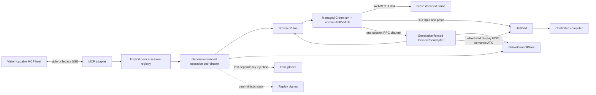

# JetKVM Expanded Public MCP — Authoritative Design

- **Original design date:** 2026-07-12
- **Superseding contract date:** 2026-07-13
- **Status:** Approved superseding architecture and public contract; implementation must be re-planned from this document
- **Repository:** `WyrmKeep/jetkvm-reliable-paste-private`
- **Public package:** `@wyrmkeep/jetkvm-mcp`
- **Executable:** `jetkvm-mcp`

## 1. Authority and objective

This document supersedes the earlier narrow computer-use contract and its transport, test, documentation, and release plan. It is the authoritative v0.1 source until replaced by a later approved specification. Existing implementation work may continue only where it satisfies this contract.

Build a production-grade MCP server for one operator-configured JetKVM per process. A vision-capable MCP host can establish an explicit device session, observe the display, drive mouse and physical keyboard input, use Reliable Paste, release all input in an emergency, inspect read-only display facts, and invoke fixed ATX actions.

The v0.1 public tool catalogue is exactly:

1. `jetkvm_session_connect`
2. `jetkvm_session_status`
3. `jetkvm_session_reconnect`
4. `jetkvm_display_capture`
5. `jetkvm_display_status`
6. `jetkvm_input_mouse`
7. `jetkvm_input_keyboard`
8. `jetkvm_input_paste`
9. `jetkvm_input_release`
10. `jetkvm_power_control`

No aliases or additional public tools ship in v0.1. All ten tools have strict input and output schemas, required bounded `timeout_ms`, explicit permission and capability checks, and actionable structured errors.

“Any MCP client” means a host/model combination that supports the published schemas and, for capture, forwards MCP image content to a vision-capable model. MCP compliance by itself does not imply image forwarding or vision.

Production behavior never assumes SSH access to the controlled host. Target-host access is a test oracle only.

## 2. Advisor decision log

Two independent Oracle consultations informed this superseding contract:

- `jetkvm-expanded-api-advisor`
- `jetkvm-expanded-security-test-advisor`

### 2.1 Adopted agreement

Both consultations and the user requirements converge on:

- a typed, capability-oriented `jetkvm_*` public API rather than a generic action façade;
- a browser/native control-plane split;
- explicit device sessions whose identity and generation appear in every session-bound call;
- story-first acceptance tests reused by fake E2E, documentation, replay, and live hardware runs;
- read-only EDID reporting;
- fixed semantic ATX actions rather than caller-selected pulse timing;
- browser ownership of frame capture, mouse, physical keyboard, Reliable Paste, and emergency input release;
- native ownership of health/status, resolution/EDID reads, and ATX;
- preservation of the completed Node package/domain/device-lease work and the Go generation-scoped lease/quiesce manager.

### 2.2 Deliberate divergences and user overrides

- Advisor 1 recommended a hybrid that included a newer HTTP transport. V0.1 deliberately ships only **stdio plus legacy HTTP/SSE**. Streamable HTTP is deferred to a separately reviewed post-v0.1 change so v0.1 does not carry three transports and remains faithful to the literal release scope.
- Advisor 1 also included virtual media. The user explicitly removed that capability from the product, public API, internal interfaces, tests, documentation, and release scope.
- Tailscale is allowed only as operator-provided network configuration. The server does not discover it, require it, advertise it as a trust boundary, derive authorization from it, or substitute it for Host, Origin, or authentication checks.
- LAN, Tailscale-routed, and HTTPS JetKVM URLs are valid operator configuration. None is hard-coded or required. The model can never select or modify the URL or credentials.

## 3. Scope and non-goals

### 3.1 V0.1 scope

- One configured JetKVM device per server process.
- Multiple authenticated MCP transport connections may address explicit device sessions.
- Device sessions are independent of MCP transport sessions.
- Stdio is the default transport; legacy HTTP/SSE is explicit opt-in.
- Managed Chromium loads the authenticated JetKVM UI and owns the WebRTC session.
- The normal product UI paths perform video decode, pointer/keyboard dispatch, and Reliable Paste.
- Native control reads status, health, current resolution, and EDID metadata and performs fixed ATX actions.
- All mutation uncertainty is surfaced rather than hidden or replayed.

### 3.2 Non-goals

- Arbitrary Internet discovery, JetKVM Cloud/TURN setup, or automatic network selection.
- Serial, appliance shell, file transfer, OCR, semantic UI understanding, or target-host SSH in production.
- EDID mutation.
- Caller-defined ATX pulse widths, delays, sequences, or GPIO operations.
- Automatic focus detection or claims that device acknowledgement proves target-application acceptance.
- Automatic mutation replay after timeout, cancellation, disconnect, takeover, stale generation, malformed response, or uncertain acknowledgement.
- Experimental MCP Tasks, SDK v2 migration, OCI images, standalone native binaries, or npm registry publication as v0.1 release gates.

## 4. Architecture



### 4.1 Plane ownership

`BrowserPlane` exclusively owns authenticated browser lifecycle and the single WebRTC connection. It sources the only session RPC channel, creates its generation-bound `DeviceRpcAdapter`, and invalidates that adapter before replacing or closing the channel. It also owns:

- fresh decoded-frame capture and immutable observation geometry;
- mouse events through the normal UI path;
- physical keyboard events through the normal UI path;
- Reliable Paste with correlated lifecycle events and approximately 91 characters/second sustained pacing under the validated profile;
- emergency input release, including deferred-producer joins, correlated paste cancellation, dispatch quiescence, and zero-state input.

`NativeControlPlane` owns adapter-qualified display/EDID semantics and ATX dispatch policy, but it does not own or create WebRTC/RPC channel lifecycle:

- separate RPC reachability, native-process availability, setup/auth mode, and compatibility facts; there is no aggregate native health fact in the current product;
- cached/event-derived native capture state, resolution, FPS, observation time, and freshness;
- read-only EDID availability and parsed metadata only after a lower-layer read result is proven;
- fixed semantic ATX actions through an extension/readiness gate, serialized dispatcher, and idempotency boundary.

For each published device-session generation, the registry injects the exact same `DeviceRpcAdapter` instance into BrowserPlane and NativeControlPlane. That adapter is sourced from the one Browser-owned WebRTC session; no plane may create a second WebRTC connection, data channel, or direct native bypass. It exposes no raw method-name/string dispatch and no general JSON-RPC escape hatch—only typed allowlisted read-only display/EDID calls and semantic ATX calls. NativeControlPlane remains owner of meaning, authorization, freshness, serialization, idempotency, and result qualification; the shared adapter owns only channel binding, generation fencing, typed wire translation, and correlated send/response boundaries.

Every adapter call carries session ID, session generation, connection epoch, and browser channel generation. The adapter checks all four at admission and immediately before send, rejects a stale/replaced binding with zero downstream calls, and rejects or classifies an in-flight replacement at the actual pre/post-write boundary. A cached display observation may still be returned explicitly as stale after channel loss; a fresh EDID read or ATX mutation requires the current live binding.

Emergency release is a BrowserPlane responsibility at the public boundary, but it invokes the session-bound firmware `quiesceAndZero` primitive. The server injects the authoritative Go manager generation; browser channel generation is never treated as firmware generation.

### 4.2 Stable internal interfaces

```ts
type SessionRef = {
  sessionId: string;
  sessionGeneration: number;
};

type Deadline = {
  timeoutMs: number;
  signal: AbortSignal;
};

type DeviceRpcBinding = SessionRef & {
  connectionEpoch: number;
  browserChannelGeneration: number;
};

interface DeviceRpcAdapter {
  readonly binding: DeviceRpcBinding;
  readDisplayState(
    ref: DeviceRpcBinding,
    deadline: Deadline,
  ): Promise<CachedDisplayState>;
  readEdid(
    ref: DeviceRpcBinding,
    deadline: Deadline,
  ): Promise<QualifiedEdidRead>;
  performAtx(
    ref: DeviceRpcBinding,
    request: {
      requestId: string;
      action: "press_power" | "hold_power" | "press_reset";
    },
    deadline: Deadline,
  ): Promise<AtxWireReceipt>;
}

interface FakeDeviceRpcAdapter extends DeviceRpcAdapter {
  loadScenario(scenario: PlaneScenario): void;
  replaceBinding(next: DeviceRpcBinding): void;
  events(): readonly PlaneEvent[];
}

interface ReplayDeviceRpcAdapter extends DeviceRpcAdapter {
  loadTrace(trace: SanitizedPlaneTrace): void;
  assertExhausted(): void;
}

interface BrowserPlane {
  connect(ref: SessionRef, deadline: Deadline): Promise<BrowserConnection>;
  reconnect(ref: SessionRef, deadline: Deadline): Promise<BrowserConnection>;
  capture(
    ref: SessionRef,
    request: CaptureRequest,
    deadline: Deadline,
  ): Promise<Observation>;
  mouse(
    ref: SessionRef,
    request: MouseRequest,
    deadline: Deadline,
  ): Promise<MutationReceipt>;
  keyboard(
    ref: SessionRef,
    request: KeyboardRequest,
    deadline: Deadline,
  ): Promise<MutationReceipt>;
  paste(
    ref: SessionRef,
    request: PasteRequest,
    deadline: Deadline,
  ): Promise<PasteReceipt>;
  release(
    ref: SessionRef,
    request: ReleaseRequest,
    deadline: Deadline,
  ): Promise<ReleaseReceipt>;
  close(ref: SessionRef, deadline: Deadline): Promise<void>;
}

interface NativeControlPlane {
  sessionStatus(
    ref: SessionRef,
    deadline: Deadline,
  ): Promise<NativeSessionStatus>;
  displayStatus(
    ref: SessionRef,
    deadline: Deadline,
  ): Promise<NativeDisplayStatus>;
  powerControl(
    ref: SessionRef,
    request: PowerRequest,
    deadline: Deadline,
  ): Promise<PowerReceipt>;
}

type SessionPlaneBundle = {
  browser: BrowserPlane;
  native: NativeControlPlane;
  deviceRpc: DeviceRpcAdapter; // the same injected instance in both planes
};

interface FakeBrowserPlane extends BrowserPlane {
  loadScenario(scenario: PlaneScenario): void;
  events(): readonly PlaneEvent[];
}

interface FakeNativeControlPlane extends NativeControlPlane {
  loadScenario(scenario: PlaneScenario): void;
  events(): readonly PlaneEvent[];
}

interface ReplayBrowserPlane extends BrowserPlane {
  loadTrace(trace: SanitizedPlaneTrace): void;
  assertExhausted(): void;
}

interface ReplayNativeControlPlane extends NativeControlPlane {
  loadTrace(trace: SanitizedPlaneTrace): void;
  assertExhausted(): void;
}
```

Fakes and replays implement the same interfaces as production. They can deterministically force timeout, cancellation, disconnect before write, disconnect after write, malformed response, permission denied, capability missing, busy/takeover, stale generation, partial verification, event gap, and duplicate request-id branches. Replays reject any unrecorded call or ordering mismatch; they never silently synthesize success.

The native adapter is a new semantic boundary, not a direct export of existing JSON-RPC handlers. Current firmware has no unified health or reconnect operation. Automatic native-process supervision, WebRTC close/takeover cleanup, and `quiesceAndZero` are useful inputs but none proves reconnection. A reconnect succeeds only after the adapter establishes a new browser/WebRTC/RPC/HID channel generation and observes the required capabilities.

Native display state is currently callback-fed cache. The adapter returns its `observedAt`, age, provenance, and freshness and ignores the proxy `streaming` field because the normal gRPC proxy omits it and reconstructs an untrustworthy zero value. EDID retrieval uses the read-only `VIDIOC_G_EDID` path, but the current cgo wrapper loses open/ioctl failures; implementation must propagate that lower-layer result or conservatively return `EDID_READ_FAILED`, never a successful empty/read value.

ATX adapts the existing actions exactly: `press_power` maps to `power-short` with a 200 ms press, `hold_power` maps to `power-long` with a 5 s press, and `press_reset` maps to `reset` with a 200 ms press. Before dispatch it verifies the `atx-power` extension and serial readiness, authorizes, serializes against every other ATX action, and claims the request-id slot. Its receipt distinguishes completed local serial ON/OFF writes from a separately timestamped ATX LED observation. Neither is proof that the host changed state.

The registry publishes a `SessionPlaneBundle` only after the Browser-owned RPC channel is open and its adapter binding matches the authoritative session, connection, and channel generations. Replacement first invalidates the old adapter, aborts its pending calls, and only then publishes a new bundle. NativeControlPlane never retains or calls an adapter from an older bundle.

### 4.3 Preserved foundation safety

The existing Node foundation remains required:

- Node 22, ESM, strict TypeScript, production-only package allowlist, and runtime-policy assertion before transport or device setup;
- SDK isolation under `src/mcp/`;
- typed domain results and field-by-field mapping to exact snake_case wire objects;
- device-keyed process lease acquired before session claim and inherited by live tooling;
- one bounded mutation coordinator plus a separate emergency-release lane;
- credential, image, and evidence redaction rules;
- hardware-free package and installed-artifact verification.

The existing Go safety foundation remains required:

- a serialized manager owns monotonic session generations and ordinary HID dispatch leases;
- every gadget write requires a current ordinary lease or unforgeable maintenance lease;
- `quiesceAndZero(expectedGeneration, operationId)` enters draining, rejects new work, cancels and joins macro/RPC workers, waits for ordinary leases to reach zero, acquires the maintenance lease, writes keyboard and pointer zero state, and returns correlated step acknowledgements;
- stale generations fail without writing;
- takeover quiesces the old generation before publishing the new generation;
- the session-bound wire handler carries `operationId` and injects its authoritative manager generation;
- ICE candidates remain scoped to the signaling connection and session that created the offer;
- simultaneous offers are serialized and race-tested.

These invariants apply to browser input, Reliable Paste, emergency release, reconnect, takeover, and process cleanup.

### 4.4 Browser bridge invariants

The versioned production bridge has stable route-lifetime identity and exposes capabilities, lifecycle events, physical-key resolution, one-shot input arming, transport-level receipts, Reliable Paste lifecycle, cancellation, and correlated release. Production never uses test hooks.

For every HID-affecting event:

1. Node validates permission, capability, session generation, observation, deadline, and complete batch.
2. The bridge arms the event with operation, display, dispatch, and channel generations.
3. A synchronous capture guard admits or blocks it.
4. The normal product handler executes.
5. The actual HID/JSON-RPC queue point records the transport-level receipt.

Capture admission is not dispatch proof. Channel replacement before queueing is `not_sent`; loss after queueing and before a definitive correlated receipt is `unknown`. Unmount cannot return a successful no-op.

The bridge reprobes keyboard layout and paste capability whenever channel generation changes and resets both on reconnect, route remount, firmware change, or session reset. The browser is forced to absolute pointer mode with scroll throttling disabled; mismatch blocks observation and input.

## 5. Explicit device sessions, ownership, and generations

### 5.1 Independence from transport

An MCP stdio connection or HTTP/SSE connection is only a protocol carrier. It never owns hardware and its transport session identifier is never accepted as a device session identifier.

`jetkvm_session_connect` creates a server-issued opaque `session_id` and generation. Every subsequent session-bound call supplies both. Device-session authorization binds the session to the authenticated principal and configured device, not to one SSE connection. Reconnecting an SSE stream neither reconnects nor takes over the device. Losing an SSE stream does not transfer ownership.

Device sessions end only through process shutdown, configured inactivity expiry, authoritative takeover, or an unrecoverable closed state. Cleanup always closes the mutation gate, aborts queued work, quiesces the owned generation, closes Browser/WebRTC, and invalidates observations before another generation can publish.

### 5.2 Connect and takeover

`takeover` defaults to `false`. Connect or reconnect never steals an active session unless the caller explicitly sets `takeover:true` and has `session.takeover` permission.

Without takeover, an occupied device returns `CONTROL_BUSY` with the owning session identity redacted, `safe_to_retry:true`, and `required_next_step:"wait_or_request_takeover"`. With authorized takeover, the old generation is synchronously marked taken over, its mutation gate closes, queued work aborts, `quiesceAndZero` completes, its WebRTC closes, and only then may the new generation publish. The old session never automatically reclaims control.

### 5.3 State and fencing

```text
UNCLAIMED -> AUTHENTICATING -> CONNECTING -> READY
READY -> DEGRADED | DRAINED | TAKEN_OVER | CLOSING | FAILED
DEGRADED | DRAINED | TAKEN_OVER | FAILED -> RECONNECTING -> READY(new generation)
```

The coordinator maintains:

- opaque `session_id`;
- monotonic `session_generation`;
- monotonic `connection_epoch`;
- monotonic `display_generation`;
- monotonic `dispatch_generation`;
- browser `channel_generation`;
- unique `operation_id`;
- client mutation `request_id`;
- one bounded normal mutation queue and one emergency-release lane.

A reconnect always increments session generation, invalidates all observations, and sets `fresh_capture_required:true`. No input mutation is admitted until a new capture from that exact generation succeeds.

There is no existing unified reconnect or native restart acknowledgement to reuse. Native auto-restart, `quiesceAndZero`, ICE close, and takeover cleanup are not reconnect proof. The reconnect adapter must observe a newly established Browser/WebRTC connection, RPC channel, HID capability, browser channel generation, and compatible bridge state before returning `applied`; otherwise it returns `not_sent` or `unknown` at the actual boundary and keeps fresh capture required.

## 6. Observation fencing

### 6.1 Fresh frame

Capture records decoded metadata, then waits for `requestVideoFrameCallback` to advance `presentedFrames` or `mediaTime` after capture begins. It draws that exact frame. No advancement before the deadline returns `VIDEO_STALLED`.

An `Observation` contains:

```ts
type Observation = {
  observationId: string;
  sessionId: string;
  sessionGeneration: number;
  connectionEpoch: number;
  displayGeneration: number;
  frameId: string;
  capturedAt: string;
  monotonicAgeMs: number;
  sourceWidth: number;
  sourceHeight: number;
  imageWidth: number;
  imageHeight: number;
  rotation: 0 | 90 | 180 | 270;
  geometry: RenderedContentGeometry;
  format: "jpeg" | "png";
  sha256: string;
  byteLength: number;
};
```

Image bytes appear only in the MCP `content[]` image block referenced by the structured result. They never appear in structured JSON, text results, logs, errors, reports, replays, or evidence.

### 6.2 Reservation, consumption, and invalidation

- An input mutation requires a current `observation_id` from the same session and generation.
- Maximum observation age defaults to 30,000 ms and is operator-bounded. It is checked at admission and immediately before first dispatch or paste acceptance.
- Admission atomically reserves an observation for one mutation.
- First transport write or paste acceptance consumes it.
- `not_sent` releases the reservation if the observation is still current.
- `applied`, `already_applied`, or `unknown` consumes it permanently.
- Route/navigation, video metadata, dimensions, source, rotation, rendered content rectangle, bridge remount, reconnect, takeover, or connection epoch changes increment/invalidate the relevant generation and all observations.
- Mouse coordinates are integer, top-left-origin coordinates within the exact returned image. Mapping removes letterbox/pillarbox and uses the immutable captured geometry.
- Later decoded frames alone do not invalidate an unused observation, but age and current stream health still apply.

Every successful mouse, keyboard, or paste mutation attempts a fresh post-operation capture. Failure of that secondary capture is reported as partial verification; it never turns dispatched input into `not_sent`.

## 7. Transport and network security

### 7.1 Stdio

- Stdio is the default and requires no network listener.
- Stdout contains MCP protocol frames only.
- Logs and diagnostics use stderr and remain field-aware and redacted.
- Startup assertions run before any stdout write, browser launch, listener, credential read, or device contact.
- Stdio accepts at most 2 MiB per newline-delimited input frame, bounds the aggregate accepted output queue to 16 MiB, and closes after 10 seconds of output backpressure.
- Normal EOF and explicit close perform idempotent cleanup; they never exit the process or destroy stdin/stdout. Injected or shared streams likewise never force process exit or destroy their underlying streams.
- Output queue overflow or write timeout forces `exit(1)` only when the transport streams are exactly `process.stdin` and `process.stdout`, and only after idempotent close plus a bounded stderr diagnostic flush. This exceptional process-owned-stream path is required because Node pipe `WriteWrap` operations cannot be cancelled.
- The stdio transport identity is never a hardware ownership identity and never substitutes for application `session_id` plus `session_generation`.

### 7.2 Legacy HTTP/SSE

Legacy SSE is enabled only by an explicit `serve-sse` operator choice. The MCP HTTP adapter—not the JetKVM UI server and not deprecated per-transport header options—owns the complete boundary:

- Authentication, authorization, exact Host validation, and Origin/anti-CSRF policy run in MCP HTTP middleware on **both** `GET /sse` and `POST /messages` before transport creation, transport lookup, or body dispatch. Missing Host is deliberately classified there, preserving 401 for bearer failure and 403 after successful authentication. The transport's header options cannot protect `GET /sse` and are not the primary control.
- `GET /sse` creates one SDK 1.29 `SSEServerTransport("/messages", response)`, stores it under its generated UUID routing key, and opens `text/event-stream` with `Cache-Control: no-cache, no-transform` and `Connection: keep-alive`.
- Its first frame is exactly `event: endpoint` with `/messages?sessionId=<uuid>` as data. Server JSON-RPC frames are exactly `event: message` with one JSON value as data.
- `sessionId` is only an opaque map key. It is never authentication, authorization, a device-session ID, or hardware ownership evidence. Authentication occurs before lookup; the map entry is additionally principal-bound.
- A global route-attempt rate ceiling runs before authentication, routing, and media validation. Authenticated global and principal stream/POST ceilings remain in force; each POST session rate and concurrency bucket is keyed by the authenticated principal plus the opaque routing key, so one principal cannot consume another principal's bucket even when guessing the same UUID.
- Project-owned `checkContinue` and `checkExpectation` handlers send every `Expect` request through that same single route-attempt and Host/authentication/Origin/anti-CSRF admission before any interim bytes. An admitted `POST` with `Expect: 100-continue` receives exactly one 100 response before the bounded body path; an admitted `GET` receives no interim response and retains normal GET/body rules. Other expectations receive a fixed 417 only after admission. Rejected authentication or Host policy receives the canonical 401/403 without a 100 response.
- `POST /messages?sessionId=<uuid>` requires one `application/json` JSON-RPC message and a maximum 2 MiB body. The adapter parses once and passes that parsed body to `handlePostMessage`; it never lets two body readers race.
- Missing or malformed `sessionId` returns adapter-owned 400; unknown, closed, expired, or cross-principal routing returns adapter-owned 404 without revealing which condition; invalid media type/body/message returns 400; an accepted message returns 202. Authentication/authorization failures use the common MCP HTTP 401/403 policy before these routing statuses. If `handlePostMessage` finds that the GET-created SSE response is no longer active, installed SDK 1.29 writes 500 `SSE connection not established` and throws; the adapter catch checks `headersSent`/`writableEnded`, preserves that response, and never writes a second status or body. Any other pre-header internal POST failure returns one redacted 500.
- A close removes the map entry and principal binding exactly once, while tolerating the SDK close callback more than once. Server shutdown closes all transports and empties the map. There is no legacy transport resumption API.
- If the SSE stream closes between lookup and `handlePostMessage`, the adapter preserves the SDK's already-written response, does not attempt a second response, and reports transport closure through redacted diagnostics.
- Keepalive comments carry no application data. Header, connection, idle, write, and total operation deadlines are bounded.
- The HTTP parser is constructed and attached with immutable `maxHeaderSize = 16 KiB` and `insecureHTTPParser = false`; the project-owned HTTPS constructor ignores caller attempts to enlarge or relax either bound. Incomplete TLS handshakes expire by an absolute deadline no later than the configured header deadline. A separate absolute per-connection request-header deadline starts at HTTP socket acceptance or completed TLS handshake and starts fresh after each keep-alive response, rather than relying on Node's periodic header sweep.
- Request bodies grow geometrically only as bytes arrive and retain no attacker-sized chunk list. Reservations are atomic across fixed 64 MiB adapter-wide, 16 MiB per-principal, and 4 MiB per-SSE-session ceilings; failure reserves no scope, and every completion, rejection, socket close, or adapter close releases all scopes. Each original `IncomingMessage` chunk is zeroed in `onData` `finally`, and every private coalescing allocation is zeroed before replacement or release, including over-limit and capacity-rejection paths.
- The default and minimum configured serialized SSE response ceiling is 14 MiB, leaving headroom under the fixed 16 MiB per-stream queue ceiling. Queued response reservations are atomic across fixed 64 MiB adapter-wide, 16 MiB per-principal, and 16 MiB per-stream ceilings, are released on write completion, drain, close, or error, and capacity failure closes only the offending stream without recursively writing an error.
- Handler admission uses the original registry as a stable adapter-wide key, so the global, principal, and application-session execution ceilings cannot be multiplied by opening more SSE streams. A stream lifetime signal cancels every handler carried by that stream, including a request whose JSON-RPC ID was reused.
- Adapter close destroys every active POST socket, aborts body reads and stream handlers, and resolves only after POST, body-memory, handler-admission, and queued-response reservations have completed their `finally` cleanup.
- Transport close cancels only requests carried by that transport; it does not transfer, create, reconnect, take over, or silently destroy a device session.

The listener binds `127.0.0.1` by default. Every request on both routes validates `Host` against the configured public/listen authority. Loopback rejects a mismatched `Origin` when one is present. Non-loopback binding additionally requires explicit enablement, authentication independent of JetKVM credentials, exact Host and Origin allowlists, anti-CSRF protection, no wildcard credentialed CORS, and bounded rate/concurrency. An absent Origin is rejected for non-loopback requests.

Plain HTTP is allowed only through explicit operator opt-in and emits exactly one fixed redacted stderr warning, `legacy SSE plaintext transport enabled`, when the listener starts. Non-loopback plaintext requires a second explicit dangerous-network opt-in. HTTPS uses system certificate validation with no insecure bypass. LAN addresses, Tailscale-routed addresses, and HTTPS names are operator configuration, not discovery or authorization signals.

The JetKVM device URL and credentials are process configuration. They never appear in tool inputs and cannot be selected by the model. Configuration precedence is non-secret CLI options, environment, then safe defaults. Secrets are supplied through a protected file or secret environment source; conflicts fail closed and secrets never appear on the command line.

## 8. Common wire, result, and error contracts

### 8.1 Strict roots and deadlines

All input and output roots set `additionalProperties:false`. Nested objects do the same. Unknown enum values, unknown fields, wrong types, duplicate semantic aliases, and out-of-bound values fail before controller invocation.

`timeout_ms` is required on every tool:

| Tool class                   | Minimum |    Maximum |
| ---------------------------- | ------: | ---------: |
| status/read                  |  100 ms |  30,000 ms |
| connect/reconnect/capture    |  100 ms |  60,000 ms |
| mouse/keyboard/release/power |  100 ms |  60,000 ms |
| paste                        |  100 ms | 300,000 ms |

The server may impose a lower operator-configured maximum. One monotonic deadline covers queue wait, plane calls, downstream acknowledgement, verification, and post-operation capture. Subsystems receive remaining time, never a reset timeout.

All opaque IDs are 1–128 printable ASCII characters matching `^[A-Za-z0-9][A-Za-z0-9._:-]{0,127}$`. Generations, dimensions, counts, coordinates, and millisecond values are non-negative JSON integers within the documented range. Normalized paste content is 1–262,144 UTF-8 bytes. Error messages are 1–512 characters and contain no downstream body or secret.

```ts
type PermissionName =
  | "session.connect"
  | "session.status"
  | "session.reconnect"
  | "session.takeover"
  | "display.capture"
  | "display.status"
  | "input.mouse"
  | "input.keyboard"
  | "input.paste"
  | "input.release"
  | "power.control";

type CapabilitySnapshot = {
  session_status: boolean;
  display_capture: boolean;
  display_status: boolean;
  mouse: boolean;
  absolute_pointer: boolean;
  keyboard: boolean;
  reliable_paste: boolean;
  input_release: boolean;
  power_control: boolean;
  edid_read: boolean;
};
```

### 8.2 Common success

Every success is an exact snake_case object:

```ts
type Success<T> = {
  ok: true;
  tool: JetKvmToolName;
  operation_id: string;
  session_id: string;
  session_generation: number;
  duration_ms: number;
  result: T;
};
```

Every mutation result payload includes:

```ts
type MutationState = {
  request_id: string;
  outcome: "applied" | "already_applied" | "not_sent" | "unknown";
  verification: "device_state_verified" | "device_ack_only" | "none";
  safe_to_retry: boolean;
  required_next_step:
    | "none"
    | "capture_then_retry"
    | "reconnect_then_capture"
    | "release_then_reconnect_then_capture"
    | "inspect_device_state_before_retry"
    | "wait_or_request_takeover"
    | "grant_permission"
    | "enable_capability";
};
```

`applied` means a definitive correlated device acknowledgement was received. It does not claim the target application accepted input. `device_state_verified` requires an independent post-action device read matching the intended state. `device_ack_only` is limited to a definitive correlated device acknowledgement. `none` makes no verification claim.
All success envelopes carry a non-null application session identity. Session-bound tools must echo the validated input `session_id` and generation. Connect publishes the newly issued identity. Reconnect preserves the input `session_id`, publishes the successor generation, and sets the envelope generation equal to `result.new_session_generation`. Every mutation success payload echoes the validated `request_id`.

### 8.3 Common execution error

```ts
type ToolError = {
  ok: false;
  tool: JetKvmToolName;
  operation_id: string;
  session_id: string | null;
  session_generation: number | null;
  duration_ms: number;
  error: {
    code: ErrorCode;
    message: string;
    phase:
      | "validate"
      | "authorize"
      | "queue"
      | "connect"
      | "execute"
      | "verify"
      | "cleanup";
    outcome: "applied" | "already_applied" | "not_sent" | "unknown" | null;
    verification: "device_state_verified" | "device_ack_only" | "none";
    safe_to_retry: boolean;
    required_next_step: MutationState["required_next_step"];
    details: {
      permission: PermissionName | null;
      capability: keyof CapabilitySnapshot | null;
      failed_action_index: number | null;
      dispatched_action_count: number | null;
      completed_action_count: number | null;
      downstream_stage:
        | "none"
        | "admission"
        | "write"
        | "acknowledgement"
        | "verification";
      expected_generation: number | null;
      actual_generation: number | null;
      observation_id: string | null;
    };
  };
};
```

Errors use `isError:true` and place the same mapped object in `structuredContent` and compact JSON text. MCP protocol errors are reserved for malformed MCP messages, unknown tools, schema-invalid calls, or broken server dispatch.

Stable error families include:

- configuration/auth: `CONFIG_INVALID`, `AUTH_FAILED`, `AUTH_RATE_LIMITED`, `AUTH_EXPIRED`;
- permission/policy: `PERMISSION_DENIED`, `OBSERVE_ONLY`, `SAFETY_DENIED`;
- capability/compatibility: `CAPABILITY_MISSING`, `UNSUPPORTED_UI_VERSION`, `FIRMWARE_INCOMPATIBLE`, `BROWSER_UNSUPPORTED`;
- session/ownership: `SESSION_NOT_FOUND`, `STALE_SESSION_GENERATION`, `SESSION_TAKEN_OVER`, `CONTROL_BUSY`, `SESSION_DRAINED`;
- connection/protocol: `DEVICE_UNREACHABLE`, `CONNECTION_LOST`, `DOWNSTREAM_MALFORMED_RESPONSE`;
- display/observation: `VIDEO_UNAVAILABLE`, `VIDEO_STALLED`, `FRAME_TIMEOUT`, `STALE_OBSERVATION`, `OBSERVATION_CONSUMED`, `DISPLAY_CHANGED`, `EDID_READ_FAILED`, `DISPLAY_STATUS_STALE`;
- input/paste: `INVALID_COORDINATE`, `INVALID_KEY`, `UNSUPPORTED_SCROLL_AXIS`, `PASTE_BUSY`, `PASTE_REJECTED`, `PASTE_FAILED`, `PASTE_CANCELLED`, `EVENT_GAP`;
- power: `POWER_ACTION_REJECTED`, `ATX_EXTENSION_INACTIVE`, `ATX_SERIAL_UNAVAILABLE`, `ATX_BUSY`, `POWER_STATE_UNVERIFIED`;
- generic mutation: `CANCELLED`, `DEADLINE_EXCEEDED`, `ADMISSION_CAPACITY_EXCEEDED`, `MUTATION_OUTCOME_UNKNOWN`, `PARTIAL_VERIFICATION`;
- idempotency: `REQUEST_ID_REUSED_WITH_DIFFERENT_INPUT`.

Permission and capability errors name the exact missing permission/capability in `details`, use `not_sent` for mutations, and select `grant_permission` or `enable_capability` as the required next step.
`SESSION_NOT_FOUND` and `STALE_SESSION_GENERATION` are `not_sent`, non-retryable until recovery, and require `reconnect_then_capture`. `ADMISSION_CAPACITY_EXCEEDED` is mutation-only, including connect and reconnect: phase `queue`, outcome `not_sent`, verification `none`, `safe_to_retry:true`, required next step `none`, null-or-zero action counts, and downstream stage `none`. It means the bounded request ledger rejected admission before any downstream write; it never substitutes for `MUTATION_OUTCOME_UNKNOWN`.

### 8.4 Idempotency, disconnect timing, and cancellation

Every mutation requires a client-generated `request_id`. Session-bound IDs are scoped to session ID and generation; connect IDs are scoped before session creation to the authenticated principal and configured device. The server stores a digest of the normalized input and the definitive result:

- First use executes once.
- Same ID and same digest returns `already_applied` only when the stored result proves the original applied; it returns the original `not_sent` result when no write occurred.
- Same ID with a different digest returns `REQUEST_ID_REUSED_WITH_DIFFERENT_INPUT` without dispatch.
- An `unknown` result is retained as unknown. Reuse never replays it.
- Cache loss never permits the server to infer that an operation was not sent.
- A full bounded request ledger returns `ADMISSION_CAPACITY_EXCEEDED` without dispatch; retrying the same request ID after capacity becomes available is safe.

Timing classification is mandatory:

| Boundary                                                         | Outcome           | Retry rule                                                              |
| ---------------------------------------------------------------- | ----------------- | ----------------------------------------------------------------------- |
| validation/authorization/queue failure before downstream write   | `not_sent`        | safe only after the named prerequisite                                  |
| cancellation or disconnect before transport write                | `not_sent`        | may retry with same current observation if its reservation was released |
| downstream write began, no definitive correlated acknowledgement | `unknown`         | never automatically retry; inspect, release/reconnect, and capture      |
| definitive acknowledgement received, post-read unavailable       | `applied`         | do not replay; verification is `device_ack_only`                        |
| definitive acknowledgement and independent matching read         | `applied`         | do not replay; verification is `device_state_verified`                  |
| duplicate definitive request                                     | `already_applied` | do not replay                                                           |

MCP cancellation and timeout propagate through the coordinator and planes. Queued work is removed. Active work stops at the first safe boundary. After any possible write, cancellation is an unknown outcome unless a definitive correlated acknowledgement already establishes `applied`. Background completion may refine internal cleanup but never silently changes the result already returned to the caller.

No tool reports silent no-op, partial success, or success for an unobserved acknowledgement. If a multi-event mutation dispatches only a prefix, it stops the suffix and returns `unknown` with dispatched/completed counts. It never retries the prefix or suffix.

## 9. Exact public tool catalogue

The schemas below are normative TypeScript shorthand for strict JSON Schema. Every listed field is required unless marked `?`; no unlisted field is accepted. All output payloads are wrapped in `Success<T>` or `ToolError`. `DisplayCaptureResult` used by mutation results means exactly the §9.4 `Result` object; it is not an open or extensible type.

### 9.1 `jetkvm_session_connect`

```ts
type Input = {
  request_id: string;
  takeover?: boolean; // default false
  timeout_ms: number; // 100..60000
};

type Result = MutationState & {
  state: "ready";
  connection_epoch: number;
  display_generation: number;
  takeover_performed: boolean;
  fresh_capture_required: true;
  permissions: PermissionName[];
  capabilities: CapabilitySnapshot;
};
```

The server issues the output `session_id` and generation in the common envelope. It uses only the operator-configured URL/credential. Required permission is `session.connect`; `takeover:true` additionally requires `session.takeover`. Connect-time auth, UI, firmware, browser, WebRTC, or reachability compatibility failures use their precise dedicated error codes (`AUTH_FAILED`, `UNSUPPORTED_UI_VERSION`, `FIRMWARE_INCOMPATIBLE`, `BROWSER_UNSUPPORTED`, or the applicable connection error), because those prerequisites are not `CapabilityName` snapshot keys. `CAPABILITY_MISSING` is not a legal connect error. Connect never steals unless both explicit takeover and permission are present.

Connect is an idempotent mutation. Reusing the same connect `request_id` and normalized input returns the same issued session with `already_applied`; it never creates or takes over a second session.

### 9.2 `jetkvm_session_status`

```ts
type Input = {
  session_id: string;
  session_generation: number;
  timeout_ms: number; // 100..30000
};

type ObservedFact<T> = {
  value: T;
  observed_at: string | null;
  age_ms: number | null;
  freshness: "fresh" | "stale" | "unknown";
  source: "cached_snapshot" | "cached_event" | "none";
};

type Result = {
  state:
    | "connecting"
    | "ready"
    | "degraded"
    | "drained"
    | "taken_over"
    | "closing"
    | "failed";
  connection_epoch: number;
  display_generation: number;
  dispatch_generation: number;
  browser_channel_generation: number | null;
  device_reachable: boolean | null;
  setup_state: "complete" | "required" | "unknown";
  auth_mode: "password" | "no_password" | "unknown";
  rpc_reachability: "reachable" | "unreachable" | "unknown";
  native_process: "available" | "unavailable" | "restarting" | "unknown";
  web_rtc: "connecting" | "connected" | "disconnected" | "failed" | "unknown";
  hid: "ready" | "not_ready" | "unknown";
  decoded_video: "ready" | "stalled" | "unavailable" | "unknown";
  native_capture_facts: {
    signal: ObservedFact<
      "present" | "no_signal" | "no_lock" | "out_of_range" | "unknown"
    >;
    resolution: ObservedFact<{ width: number; height: number } | null>;
    fps: ObservedFact<number | null>;
  };
  active_mutation: boolean;
  fresh_capture_required: boolean;
  permissions: PermissionName[];
  capabilities: CapabilitySnapshot;
  blocked_reason: string | null;
  versions: {
    server: string;
    protocol: string;
    ui_contract: string | null;
    firmware: string | null;
  };
};
```

Read-only and required permission `session.status`. RPC reachability, native-process availability, WebRTC, HID, decoded-video state, and each native capture fact remain separate; the adapter never collapses them into unified health. Signal, resolution, and FPS each carry their own provenance, observation time, age, and freshness because they may come from different observations: synchronous `getVideoState` cache reads use `cached_snapshot`, while asynchronous `videoInputState` updates use `cached_event`. They are never assigned a shared timestamp/freshness tuple. `source:"none"` requires `observed_at:null`, `age_ms:null`, `freshness:"unknown"`, and an unknown/null value. The omitted proxy `streaming` value is not trustworthy. Unknown facts are never inferred. No credentials, cookies, SDP, ICE, input text, or stack traces appear.

### 9.3 `jetkvm_session_reconnect`

```ts
type Input = {
  session_id: string;
  session_generation: number;
  request_id: string;
  takeover?: boolean; // default false
  timeout_ms: number; // 100..60000
};

type Result = MutationState & {
  previous_session_generation: number;
  new_session_generation: number;
  connection_epoch: number;
  state: "ready";
  takeover_performed: boolean;
  fresh_capture_required: true;
};
```

`new_session_generation` is strictly greater than `previous_session_generation`; the previous value equals the validated input generation, the result `request_id` equals the validated input request ID, and the common envelope generation equals the new value. These relational invariants are enforced at the runtime and MCP call boundaries because draft JSON Schema cannot compare arbitrary sibling numeric values.

Required permission is `session.reconnect`; takeover additionally requires `session.takeover`. Reconnect-time auth, UI, firmware, browser, WebRTC, or reachability compatibility failures use the same precise dedicated codes as connect; `CAPABILITY_MISSING` is not legal because those prerequisites are not `CapabilityName` snapshot keys. Reconnect closes/quiesces the old generation before publishing the new one and never replays an interrupted mutation. All old observations become stale. Input is blocked until a fresh capture on the new generation.

The result is not inferred from automatic native-process restart, successful input quiesce, takeover cleanup, or an ICE close. It requires new WebRTC/RPC/HID/browser-channel observations from the new generation.

### 9.4 `jetkvm_display_capture`

```ts
type Input = {
  session_id: string;
  session_generation: number;
  format?: "jpeg" | "png"; // jpeg
  max_width?: number; // 64..1920, default 1280
  max_height?: number; // 64..1080, default 720
  timeout_ms: number; // 100..60000
};

type Result = {
  observation_id: string;
  connection_epoch: number;
  display_generation: number;
  frame_id: string;
  captured_at: string;
  source_width: number;
  source_height: number;
  image_width: number;
  image_height: number;
  rotation: 0 | 90 | 180 | 270;
  geometry: {
    content_x: number;
    content_y: number;
    content_width: number;
    content_height: number;
  };
  image: {
    content_index: number;
    mime_type: "image/jpeg" | "image/png";
    sha256: string;
    byte_length: number;
  };
};
```

Read-only, required permission `display.capture`, required capability `display_capture`. Both formats preserve aspect ratio, do not crop or upscale. JPEG defaults to quality 88 and is limited to 2 MiB before base64. PNG is limited to 8 MiB before base64 so the lossless 1920×1080 RGBA8 path and every transport remain explicitly bounded. Capture is the only way to establish an input observation fence.

### 9.5 `jetkvm_display_status`

```ts
type Input = {
  session_id: string;
  session_generation: number;
  timeout_ms: number; // 100..30000
};

type EdidResult =
  | {
      status: "unsupported";
      read_completed: false;
      reason: "edid_read_capability_absent";
      observed_at: null;
      data: null;
    }
  | {
      status: "unavailable";
      read_completed: true;
      reason: "successful_read_reported_no_edid";
      observed_at: string;
      data: null;
    }
  | {
      status: "available";
      read_completed: true;
      reason: null;
      observed_at: string;
      data: {
        sha256: string;
        manufacturer_id: string | null;
        product_code: number | null;
        serial_number: string | null;
        display_name: string | null;
        preferred_resolution: {
          width: number;
          height: number;
          refresh_hz: number | null;
        } | null;
      };
    };

type Result = {
  signal: ObservedFact<
    "present" | "no_signal" | "no_lock" | "out_of_range" | "unknown"
  >;
  native_resolution: ObservedFact<{
    width: number;
    height: number;
    refresh_hz: number | null;
  } | null>;
  fps: ObservedFact<number | null>;
  edid: EdidResult;
};
```

Read-only, required permission `display.status`, and required capability `display_status`. The base tool does **not** require `edid_read`: when absent it succeeds with the exact `unsupported` EDID branch. Signal, resolution, and FPS each have independent time/age/freshness/provenance; a `getVideoState` cache read is `cached_snapshot`, a `videoInputState` callback is `cached_event`, and the adapter may select different sources/times for different facts. It never exposes or trusts proxy `streaming`. When `edid_read` is present, EDID uses only read-only `VIDIOC_G_EDID`. A proven successful read with no EDID uses `unavailable`; a proven read with bytes uses `available`. Open/ioctl/cgo failure returns `EDID_READ_FAILED`, never either successful branch. Until the lower-layer cgo failure is propagated, the adapter must return that error rather than infer empty success.

### 9.6 `jetkvm_input_mouse`

```ts
type MouseAction =
  | { type: "move"; x: number; y: number }
  | { type: "click"; x: number; y: number; button: "left" | "middle" | "right" }
  | {
      type: "double_click";
      x: number;
      y: number;
      button: "left" | "middle" | "right";
    }
  | {
      type: "drag";
      button: "left" | "middle" | "right";
      path: Array<{ x: number; y: number }>;
    }
  | { type: "scroll"; x: number; y: number; delta_y: number; delta_x?: 0 }; // delta_y: integer -127..127 excluding 0

type Input = {
  session_id: string;
  session_generation: number;
  observation_id: string;
  request_id: string;
  actions: MouseAction[]; // 1..16; drag path 2..64
  timeout_ms: number; // 100..60000
};

type Result = MutationState & {
  dispatched_action_count: number;
  completed_action_count: number;
  post_capture: DisplayCaptureResult | null;
};
```

On success both counts are positive, equal, and exactly `actions.length`. An unknown post-write error identifies the first uncompleted action with `failed_action_index === completed_action_count` and `dispatched_action_count === completed_action_count + 1`; counts are bounded by the validated action list and no suffix action is dispatched. Applied partial-verification errors have null failed index and equal positive full-request counts.

Required permission `input.mouse`, capabilities `mouse` and absolute pointer mode. Coordinates are fenced to the observation. The whole request validates before reservation or any plane call. Drag releases in cleanup. `delta_y` is signed integer HID wheel steps with JSON Schema minimum -127, maximum 127, and `not: { const: 0 }`; fractional, zero, underflow, overflow, and nonzero horizontal scroll reject the entire request with zero plane calls and zero input.

### 9.7 `jetkvm_input_keyboard`

```ts
type Letter =
  | "A"
  | "B"
  | "C"
  | "D"
  | "E"
  | "F"
  | "G"
  | "H"
  | "I"
  | "J"
  | "K"
  | "L"
  | "M"
  | "N"
  | "O"
  | "P"
  | "Q"
  | "R"
  | "S"
  | "T"
  | "U"
  | "V"
  | "W"
  | "X"
  | "Y"
  | "Z";
type Digit = "0" | "1" | "2" | "3" | "4" | "5" | "6" | "7" | "8" | "9";
type FunctionNumber =
  | "1"
  | "2"
  | "3"
  | "4"
  | "5"
  | "6"
  | "7"
  | "8"
  | "9"
  | "10"
  | "11"
  | "12";
type PhysicalKey =
  | `Key${Letter}`
  | `Digit${Digit}`
  | `F${FunctionNumber}`
  | `Numpad${Digit}`
  | "Escape"
  | "Tab"
  | "CapsLock"
  | "Space"
  | "Enter"
  | "Backspace"
  | "Insert"
  | "Delete"
  | "Home"
  | "End"
  | "PageUp"
  | "PageDown"
  | "ArrowUp"
  | "ArrowDown"
  | "ArrowLeft"
  | "ArrowRight"
  | "PrintScreen"
  | "ScrollLock"
  | "Pause"
  | "NumLock"
  | "NumpadAdd"
  | "NumpadSubtract"
  | "NumpadMultiply"
  | "NumpadDivide"
  | "NumpadDecimal"
  | "NumpadEnter"
  | "Minus"
  | "Equal"
  | "BracketLeft"
  | "BracketRight"
  | "Backslash"
  | "Semicolon"
  | "Quote"
  | "Backquote"
  | "Comma"
  | "Period"
  | "Slash"
  | "ShiftLeft"
  | "ShiftRight"
  | "ControlLeft"
  | "ControlRight"
  | "AltLeft"
  | "AltRight"
  | "MetaLeft"
  | "MetaRight"
  | "ContextMenu";

type KeyboardAction =
  | { type: "key_down"; key: PhysicalKey }
  | { type: "key_up"; key: PhysicalKey }
  | { type: "key_press"; key: PhysicalKey }
  | { type: "chord"; keys: PhysicalKey[] }; // 1..8, press order then reverse release

type Input = {
  session_id: string;
  session_generation: number;
  observation_id: string;
  request_id: string;
  actions: KeyboardAction[]; // 1..64
  timeout_ms: number; // 100..60000
};

type Result = MutationState & {
  dispatched_action_count: number;
  completed_action_count: number;
  held_keys: PhysicalKey[];
  post_capture: DisplayCaptureResult | null;
};
```

On success both counts are positive, equal, and exactly `actions.length`. Unknown post-write and applied partial-verification errors use the same exact prefix/full-request count rules as mouse.

Required permission `input.keyboard`, capability `keyboard`. This tool accepts physical keys only: there is no text, character, typing, insertion, script, or command field. Unknown keys and impossible transitions fail before dispatch. Modifiers press in listed order and release in reverse order. The held-state ledger supports ordinary cleanup; emergency release is authoritative.

### 9.8 `jetkvm_input_paste`

```ts
type Input = {
  session_id: string;
  session_generation: number;
  observation_id: string;
  request_id: string;
  text: string;
  timeout_ms: number; // 100..300000
};

type Result = MutationState & {
  original_byte_count: number;
  normalized_byte_count: number;
  normalized_sha256: string;
  accepted_at: string;
  completed_at: string;
  terminal_state: "succeeded";
  measured_chars_per_second: number | null;
  post_capture: DisplayCaptureResult | null;
};
```

Required permission `input.paste`, capabilities `reliable_paste` and current deterministic paste lifecycle. This is the only public tool that accepts free text. The validated Reliable Paste profile targets approximately 91 characters/second while retaining device batching, pacing, flow control, and correlated terminal state; it never substitutes a fixed sleep.

Normalization strips one leading UTF-8 BOM, converts CRLF and lone CR to LF, then NFC-normalizes. Limits, hashes, progress, and evidence use normalized UTF-8 bytes while reporting both counts. Before acceptance, the controller requires an unused current observation, healthy decoded stream, current channel generation, lifecycle `ready`, and configured/effective keyboard-layout equality.

Only correlated monotonic events for the operation and channel count. Success requires `submitted -> active -> succeeded`. Event gaps, missing active, duplicate/out-of-order terminal events, capability downgrade, disconnect, unmount, or timeout after acceptance produce unknown outcome and close mutation. Queue drain does not prove target-application acceptance.
Therefore `ok:true` requires the correlated `succeeded` terminal state and non-null acceptance and completion observations. Failed, cancelled, missing, or unknown lifecycle evidence is an error result, never a success envelope.

### 9.9 `jetkvm_input_release`

```ts
type Input = {
  session_id: string;
  session_generation: number;
  request_id: string;
  timeout_ms: number; // 100..60000
};

type Result = MutationState & {
  mutation_gate_closed: boolean;
  deferred_producers_joined: boolean;
  paste_terminal: "cancelled" | "inactive" | "unknown";
  ordinary_leases_zero: boolean | null;
  keyboard_zero: boolean | null;
  pointer_zero: boolean | null;
  generation_drained: boolean;
};
```

Required permission `input.release`, capability `input_release`. This emergency lane does not require an observation and preempts the normal queue. It closes the gate, invalidates observations, advances dispatch generation, aborts queued work, joins deferred producers, cancels correlated paste, and calls generation-bound `quiesceAndZero`.

Success requires correlated acknowledgements for draining, producer/macro/paste inactivity, ordinary leases zero, keyboard zero, and pointer zero, and therefore uses `device_state_verified`. Missing or stale acknowledgement returns unknown, leaves mutation closed, and requires operator inspection before retry. A successfully drained generation also remains closed; reconnect and fresh capture are required before further input.

### 9.10 `jetkvm_power_control`

```ts
type Input = {
  session_id: string;
  session_generation: number;
  request_id: string;
  action: "press_power" | "hold_power" | "press_reset";
  timeout_ms: number; // 100..60000
};

type Result = MutationState & {
  action: "press_power" | "hold_power" | "press_reset";
  wire_action: "power-short" | "power-long" | "reset";
  fixed_press_ms: 200 | 5000;
  serial_sequence_completed: boolean;
  atx_led_observation:
    | {
        power: boolean | null;
        hdd: boolean | null;
        observed_at: string;
        freshness: "fresh" | "stale";
      }
    | {
        power: null;
        hdd: null;
        observed_at: null;
        freshness: "unknown";
      };
};
```

Required permission `power.control`, capability `power_control`. The adapter additionally requires active `atx-power` extension and serial readiness, holds a single ATX mutex across the complete ON/sleep/OFF sequence, and reserves the request-id before the first write. It maps `press_power` to `power-short`/200 ms, `hold_power` to `power-long`/5000 ms, and `press_reset` to `reset`/200 ms. No duration, delay, repeat, pin, level, or arbitrary sequence is accepted.

A definitive receipt means only that the local serial ON and OFF writes completed. The asynchronous cached ATX LED observation is reported separately with time/freshness and is not correlated host-state proof. Therefore current ATX success uses at most `device_ack_only`, never `device_state_verified`. Failure of OFF after ON is unknown, closes the ATX gate, performs bounded best-effort release cleanup, and is never replayed. Disconnect after the first write without a complete receipt is likewise unknown.
Fresh and stale ATX observations always carry their observation timestamp. The unknown branch represents no observation and therefore carries null LED values and a null timestamp.

## 10. Permission and capability matrix

Every handler performs authorization before capability probing that could disclose unavailable device details, then rechecks session generation immediately before downstream work.

| Tool                       | Required permission                              | Required capability                |
| -------------------------- | ------------------------------------------------ | ---------------------------------- |
| `jetkvm_session_connect`   | `session.connect`; optional `session.takeover`   | compatible auth/UI/WebRTC          |
| `jetkvm_session_status`    | `session.status`                                 | native status                      |
| `jetkvm_session_reconnect` | `session.reconnect`; optional `session.takeover` | compatible auth/UI/WebRTC          |
| `jetkvm_display_capture`   | `display.capture`                                | display capture                    |
| `jetkvm_display_status`    | `display.status`                                 | display status; optional EDID read |
| `jetkvm_input_mouse`       | `input.mouse`                                    | mouse and absolute pointer         |
| `jetkvm_input_keyboard`    | `input.keyboard`                                 | physical keyboard                  |
| `jetkvm_input_paste`       | `input.paste`                                    | deterministic Reliable Paste       |
| `jetkvm_input_release`     | `input.release`                                  | generation-bound release           |
| `jetkvm_power_control`     | `power.control`                                  | ATX control                        |

Permission denial and capability absence are never treated as no-op success. Required next steps tell the operator to grant the named permission or enable/upgrade the named capability.

## 11. Story-first verification

### 11.1 Machine-readable story manifest

A versioned machine-readable manifest is the acceptance source for fake E2E, replay, user documentation, live hardware orchestration, and release evidence. Human prose may explain a story but may not define a second set of steps or expectations.

Each story record is strict and contains:

```ts
type AcceptanceStory = {
  id: string;
  title: string;
  requirements: string[];
  tools: JetKvmToolName[];
  environments: Array<"fake" | "replay" | "live">;
  preconditions: StoryCondition[];
  fault_script: FaultStep[];
  steps: StoryStep[];
  pass: StoryAssertion[];
  evidence: EvidenceField[];
  restore: RestoreStep[];
  privacy: PrivacyRule[];
};
```

Every story must declare setup, exact calls, timing/fault boundaries, observable pass assertions, allowed evidence fields, and unconditional restore steps. The harness validates schema and requirement coverage before execution. Generated documentation renders tool examples and failure guidance from the same manifest/schema identifiers.

The complete strict 24-story manifest is a Phase 2 deliverable together with the public schemas and fake/replay/DeviceRpcAdapter bases. Later phases fill implementations and evidence against these unchanged IDs; adding, removing, or renumbering a story requires contract review.

Required named stories include:

1. `session-connect-without-takeover-busy`
2. `session-explicit-authorized-takeover`
3. `session-reconnect-invalidates-observations`
4. `display-capture-fresh-frame-and-geometry`
5. `display-status-resolution-and-read-only-edid`
6. `mouse-observation-fence-and-single-use`
7. `keyboard-physical-keys-only`
8. `reliable-paste-91cps-correlated-terminal`
9. `emergency-release-races-every-writer`
10. `power-three-semantic-actions`
11. `disconnect-before-write-not-sent`
12. `disconnect-after-write-unknown-no-replay`
13. `duplicate-request-id-definitive-replay`
14. `malformed-response-fails-closed`
15. `permission-and-capability-errors-actionable`
16. `stale-generation-zero-downstream-write`
17. `partial-verification-does-not-replay`
18. `transport-reconnect-does-not-own-device`
19. `display-status-cached-freshness-and-streaming-omission`
20. `edid-low-level-failure-propagates`
21. `reconnect-requires-new-channel-observations`
22. `atx-extension-serialization-idempotency-and-nonproof`
23. `sse-get-and-post-share-http-security-boundary`
24. `sse-session-id-is-routing-not-authentication`
    The shared `DeviceRpcAdapter` has no separate story ID. Story 21 owns single-channel injection, old-binding invalidation, and new-generation replacement proof; story 19 owns cached/stale display behavior across binding loss; story 22 owns stale and mid-flight ATX fencing with pre/post-write outcome classification. The three §11.2 behavior rows are mandatory assertions within those canonical stories.

### 11.2 Every-handler branch matrix

Every public handler must have a manifest-linked unit/adapter assertion for every applicable branch:

| Branch                               | Required assertion                                                                                                                                                                                                  |
| ------------------------------------ | ------------------------------------------------------------------------------------------------------------------------------------------------------------------------------------------------------------------- |
| strict schema rejection              | no controller/plane call                                                                                                                                                                                            |
| permission denied                    | actionable `PERMISSION_DENIED`, no capability disclosure, no write                                                                                                                                                  |
| capability missing                   | actionable `CAPABILITY_MISSING`, no mutation; applicable only when the tool's §10 requirement is a `CapabilityName` snapshot key—connect/reconnect compatibility failures instead use their dedicated precise codes |
| deadline before admission            | `not_sent`, queue/reservation released                                                                                                                                                                              |
| cancellation before write            | `not_sent`, zero downstream writes                                                                                                                                                                                  |
| disconnect before write              | `not_sent`, safe retry classification                                                                                                                                                                               |
| disconnect after write               | `unknown`, gate closes, zero replay                                                                                                                                                                                 |
| malformed downstream response        | fail closed; `not_sent` or `unknown` according to write boundary                                                                                                                                                    |
| stale session generation             | `STALE_SESSION_GENERATION`, zero downstream writes                                                                                                                                                                  |
| busy without takeover                | `CONTROL_BUSY`, incumbent unchanged                                                                                                                                                                                 |
| authorized takeover                  | old generation quiesced before new publish                                                                                                                                                                          |
| unauthorized takeover                | permission error, incumbent unchanged                                                                                                                                                                               |
| definitive acknowledgement           | `applied` with exact verification strength                                                                                                                                                                          |
| duplicate same request/digest        | cached definitive result, zero second write                                                                                                                                                                         |
| duplicate changed digest             | idempotency error, zero second write                                                                                                                                                                                |
| partial verification                 | applied acknowledgement preserved; no replay                                                                                                                                                                        |
| partial multi-event dispatch         | unknown with exact counts; suffix suppressed                                                                                                                                                                        |
| post-reconnect input without capture | stale/fresh-capture error, zero input                                                                                                                                                                               |
| cleanup failure                      | error evidence retained, no fabricated restoration                                                                                                                                                                  |
| per-fact status provenance           | signal/resolution/FPS independently select `cached_snapshot`, `cached_event`, or `none`; unequal times/ages remain unequal; proxy streaming omitted                                                                 |
| EDID capability absent               | base display status succeeds with strict `unsupported`/capability-absent/null branch                                                                                                                                |
| EDID successful empty                | strict `unavailable`/read-completed/no-EDID/null branch                                                                                                                                                             |
| EDID lower-layer failure             | `EDID_READ_FAILED`; no empty, unavailable, or available success                                                                                                                                                     |
| reconnect evidence                   | new WebRTC/RPC/HID/browser-channel generation required; restart/quiesce alone rejected                                                                                                                              |
| ATX gate and serialization           | extension/serial preflight, one full-sequence mutex, request-id reservation, exact fixed timing                                                                                                                     |
| ATX acknowledgement semantics        | serial completion only; cached LED fact separate; no host-state proof                                                                                                                                               |
| SSE route security                   | identical MCP HTTP auth/Host/Origin boundary runs before GET creation and POST lookup                                                                                                                               |
| SSE routing/close                    | sessionId never authenticates; exact 400/404/202 and SDK internal 500 behavior; parsed-body limit; idempotent close; no double write after headers                                                                  |
| shared DeviceRpcAdapter binding      | one Browser/WebRTC RPC channel and one injected adapter instance; no direct/second channel                                                                                                                          |
| DeviceRpcAdapter replacement         | old binding invalidated before new publish; stale reads have explicit freshness; stale EDID/ATX makes zero writes                                                                                                   |
| DeviceRpcAdapter mid-flight loss     | read errors or stale cached qualification; ATX uses pre/post-write outcome classification; no replay                                                                                                                |
| scroll validation                    | integer HID wheel steps -127..127 excluding zero accepted; fraction/zero/overflow/nonzero-X rejects whole request with zero plane calls                                                                             |

Phase authority is explicit and machine-readable. Phase 2 owns the unchanged 24-story inventory and the 10×32 matrix, validates every applicable story/step/fault/assertion link, and reserves each stable `focused_assertion_id`; a cell carries `focused_assertion_phase_2_status: "reserved"` plus `focused_assertion_owner_phase: "phase_3" | "phase_4" | "phase_5"`. Phase 2 validates reservation uniqueness and ownership only: it exposes no owning-phase or release registration gate, and no reservation satisfies a later phase or release gate. Phase 3 owns future input/display assertions, Phase 4 owns future session/power assertions, and Phase 5 owns future shared-transport/system assertions. An owning phase may introduce a registration validator only when the gate consumes an execution-produced result set keyed by exact assertion ID and cross-checks each result against an existing focused test file, its exact test identity, and the matrix owner phase. File existence alone is insufficient. Until that evidence exists, the validator is deferred to the owning implementation phase and the corresponding gate remains unsatisfied; filename regexes, path-shaped strings, reserved IDs, named-but-unexecuted tests, skips, and fabricated no-op assertions are never approval evidence.

Deadline-before-admission and cancellation-before-write coverage is executable only when each linked tool call names its own compatible deterministic fault. The validator requires that fault to be armed immediately after the preceding serialized story step, remain active through the linked call, and be cleared immediately after that call before another tool is armed. Where a mutation cell claims request or observation reservation release, the cleared-fault retry immediately reuses the same normalized input and its tool-unique request ID. A cleared fault, a fault for another tool, or a prose label without this ordering never satisfies the cell.

Input handlers additionally cover stale/consumed/foreign observations, display change before and after first dispatch, invalid coordinates/keys, held-state cleanup, post-operation capture failure, and whole-request scroll rejection before any plane call. Paste additionally covers event gap, cancellation, lifecycle downgrade, layout mismatch, and timeout before/after acceptance. Release additionally races every deferred producer and ordinary writer. Power covers all three actions and no fourth value.

### 11.3 Test layers

1. **Go generation manager:** pure race tests and root integration compile/tests cover lease admission, stale generation, takeover, quiesce, maintenance zero writes, writer joins, and ICE scoping.
2. **UI bridge and DeviceRpcAdapter:** lifecycle, single-RPC-channel injection, generation/connection/channel fencing, old-adapter invalidation before replacement, capture guard, transport receipts, capability reset, physical-key resolution, Reliable Paste events, producer joins, and correlated release.
3. **Domain/controller:** strict schemas, deadlines, observation reservation, idempotency, outcome classification, permissions, capabilities, shared-adapter identity, stale/replaced binding branches, per-fact unequal provenance/freshness, all three successful EDID branches plus lower-layer error, exact scroll bounds/zero-plane rejection, plane errors, and redaction.
4. **Fake E2E:** every manifest story runs with deterministic plane faults and a fake monotonic clock.
5. **Replay E2E:** sanitized production-shaped traces prove call ordering and reject unrecorded behavior.
6. **Transport:** installed tarball over stdio and two-client legacy SSE; stdout purity; exact endpoint/message framing; MCP HTTP middleware on both `/sse` and `/messages`; auth-before-lookup; sessionId routing-only semantics; adapter-owned body/status/close behavior; Host, Origin, anti-CSRF, cancellation, and device-session independence.
7. **Real browser fixture:** exactly one WebRTC/RPC channel shared through one adapter, adapter replacement fencing, fresh frame, geometry, pointer, physical keyboard, paste lifecycle, disconnect timing, takeover, ATX pre/post-write loss, and zero post-release events.
8. **Live hardware:** manual/nightly and mandatory for release, serialized under the release lease.
9. **Package/schema:** generated schema byte comparison, production allowlist, installed artifact, secret/payload scans, dependency/browser pins, and clean-checkout reproducibility.

No advertised option or branch may lack a manifest requirement and evidence row. Unsupported options are absent from schemas.

### 11.4 Hardware safety, privacy, and restore

All hardware stories run serially under one device-keyed lease inherited from the outer harness. The lease is acquired before any device read, deployment, browser claim, doctor action, packed-server run, or evidence capture and is released only after final restoration and evidence flush. Stale or mismatched lease proof fails closed.

Before each story, the harness records safe baseline facts: candidate/device revision, session generation, display resolution, layout, lock-key state, ATX-observable state, browser version/sandbox, and fixture identity. Each story has an outer `finally` that executes its manifest restore steps even after assertion, timeout, or cancellation failure. Restoration includes emergency release, paste inactivity, zero held keys/buttons, browser/session cleanup, fixture reset, and—where a power story changed it—the declared baseline power state. The next story cannot start until restore assertions pass.

Hardware evidence is privacy-safe and machine-validated. It may store:

- story/requirement IDs and pass/fail;
- commit/tree/package/schema hashes;
- sanitized device/firmware/browser versions;
- opaque operation, request, observation, and generation IDs;
- dimensions, counts, durations, outcome, verification, acknowledgement steps, and first-mismatch index;
- normalized test-payload hashes and artifact hashes.

It must not store screenshots, raw image/base64, pasted text, typed keys beyond allowlisted fixture action names, credentials, cookies, bearer tokens, lease proofs, headers, SDP/ICE, target document contents, serial-like EDID values in public artifacts, or stack traces containing secrets. The server and harness never persist screenshots.

## 12. Documentation contract

V0.1 documentation is generated or checked against public schemas and story IDs and must include:

- exact ten-tool catalogue and examples;
- explicit device-session versus MCP transport-session semantics;
- takeover default false and authorization requirements;
- observation fencing, reconnect, cancellation, disconnect timing, idempotency, and unknown-outcome recovery;
- physical-key-only keyboard guidance and Reliable Paste as the sole free-text path;
- expected approximately 91 characters/second paste profile without a universal throughput guarantee;
- cached/event-derived resolution status with `observed_at`/freshness, omission of untrustworthy proxy streaming, qualified read-only EDID results/failures, and the three fixed ATX mappings/timings with serial acknowledgement explicitly not host-state proof;
- stdio setup and protocol-only stdout;
- opt-in legacy SSE setup, exact `/sse` and `/messages` framing/body/status/close behavior, both routes protected at the MCP HTTP layer, `sessionId` as routing only, loopback default, and non-loopback Host/Origin/auth requirements;
- operator-configured LAN, Tailscale-routed, and HTTPS URLs without implying any required network product;
- plain-HTTP warnings, system TLS validation, secret handling, permissions, capabilities, and actionable errors;
- safety/limitations, no target-application acceptance claim, recovery, hardware restore, compatibility, release verification, and rollback.

Documentation examples must execute against fake or replay adapters in CI. No example may use a hidden tool, unbounded timeout, model-selected URL/credential, arbitrary ATX timing, mutation replay after unknown, or stale observation.

## 13. Six-phase branch, PR, and release flow

Work lands through exactly six sequential branches/PRs:

| Phase | Branch                             | Deliverable                                                                                                                                                                                                                                                                                             |
| ----: | ---------------------------------- | ------------------------------------------------------------------------------------------------------------------------------------------------------------------------------------------------------------------------------------------------------------------------------------------------------- |
|     1 | `feat/jetkvm-mcp-foundation`       | Preserved Node package/domain/device lease; Go generation manager, dispatch leases, quiesce/zero, takeover and ICE fencing; strict shared result/error/idempotency types                                                                                                                                |
|     2 | `feat/jetkvm-mcp-transport-api`    | Exact ten schemas and adapter handlers; complete strict 24-story manifest; stdio; legacy `/sse` + `/messages`; auth/Host/Origin/security; transport-independent session registry; single-session DeviceRpcAdapter lifecycle/injection/generation fencing; fake/replay bases                             |
|     3 | `feat/jetkvm-mcp-input-display`    | BrowserPlane capture/observation fences, mouse including exact HID wheel validation, physical keyboard, Reliable Paste near 91 chars/s, emergency release, plus NativeControlPlane status/display semantics, per-fact cached freshness, and qualified optional read-only EDID over the injected adapter |
|     4 | `feat/jetkvm-mcp-power-session`    | Explicit connect/status/reconnect/takeover with new-channel proof and serialized/idempotent exact-timing ATX semantics over the injected adapter, with no host-state claim                                                                                                                              |
|     5 | `feat/jetkvm-mcp-system-e2e-docs`  | Manifest-driven every-handler branch matrix, fake/replay/transport/browser E2E, generated/checked docs, packaging and required CI                                                                                                                                                                       |
|     6 | `feat/jetkvm-mcp-hardware-release` | Serialized live stories, privacy-safe evidence, per-story restore gates, exact-candidate manifest, clean-install verification, tag and GitHub release assets                                                                                                                                            |

### 13.1 Mandatory gate for every phase

Each branch is created from the freshly updated default branch after the preceding PR merges. Branches are not stacked. Each phase opens a fresh PR and must satisfy all of these before merge:

1. The phase contract and changed schemas/stories receive an advisor review that cites `jetkvm-expanded-api-advisor` and `jetkvm-expanded-security-test-advisor`, with any deliberate divergence recorded.
2. Independent PR reviewers classify findings P0 (safety/security/data loss), P1 (contract/correctness/release blocker), P2 (maintainability/test gap), or P3 (minor).
3. All P0/P1 findings are fixed and re-reviewed to zero. P2 findings are fixed or explicitly accepted by the maintainer with rationale; P3 findings are tracked or resolved.
4. Required CI is green for the exact reviewed head.
5. The full applicable local suite passes from a clean checkout of that exact head, including package/install tests rather than only workspace tests.
6. The worktree is clean, generated schemas match, production/package allowlists match, and no unreviewed diff exists.
7. Any code, lockfile, generated file, schema, story, documentation, workflow, or package change after a gate invalidates downstream approvals and reruns the affected advisor review, reviewer check, CI, local suite, and clean-checkout gate.

No phase merges with an unresolved P0/P1, red CI, skipped applicable local gate, dirty checkout, or evidence from a different commit.

### 13.2 Final candidate and hardware gate

Phase 6 freezes PR-head commit `C`, tree `G`, and one allowlisted npm tarball `T`. The hardware lease covers deployment/readiness, every live story, every per-story restore, final status, evidence flush, and cleanup. Live evidence must identify `C/G/T`; it may not be reused from another tree or artifact.

The external immutable manifest is a PR/CI artifact and later a GitHub release asset, never self-referential content inside `G`. It records spec/schema/story hashes, candidate commit/tree, tarball/lockfile/package-tree hashes, Node/browser/device versions and hashes, all zero-skip requirements, story outcomes, operation/request/observation/generation IDs, sanitized timing/count/hash evidence, restore results, and artifact hashes.

Merge must preserve `C` as an ancestor and produce the reviewed tree `G`. Conflict resolution or any source/package/lockfile/tree change creates a new candidate and reruns affected gates and live stories. The release tag points to the verified candidate. The GitHub release contains exact `T`, checksum, schemas, compatibility/setup/security/rollback guidance, and the immutable manifest.

Finally, a clean directory downloads the release assets, verifies checksums, installs `T`, initializes and lists exactly the ten tools over stdio and loopback legacy SSE, exercises manifest smoke stories, and runs the offline doctor with zero device signaling. Release is blocked unless this exact-artifact verification and final hardware restoration both pass.
