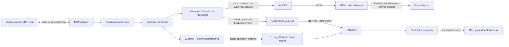

# JetKVM Computer-Use MCP — Design

- **Date:** 2026-07-12
- **Status:** Approved for implementation; Oracle Run 3 and independent checker convergence complete
- **Repository:** `WyrmKeep/jetkvm-reliable-paste-private`
- **Public package:** `@wyrmkeep/jetkvm-mcp`
- **Executable:** `jetkvm-mcp`

## 1. Objective

Build a production-grade Model Context Protocol server that gives a vision-capable agent a Codex-style computer-use loop over a physical JetKVM:

1. capture a fresh image of the controlled computer;
2. execute an ordered batch of pointer/keyboard actions grounded in that image;
3. return a new image;
4. use JetKVM Reliable Paste for long commands, prose, and file contents.

The first release controls one configured JetKVM per process. The first live target is `192.168.1.110`, which was observed on 2026-07-12 running firmware revision `58eac4f7216a6bd7963783c015a8a7a1de952d29`. The attached Windows rig at `192.168.1.155` is an independent test oracle only. Production behavior never assumes SSH access to the controlled host.

“Any MCP client” means an MCP host/model combination that forwards tool-result images to a vision-capable model and supports the published schemas. MCP compliance alone does not imply image forwarding or vision.

## 2. Required result

The deliverable is complete only when all of these statements have direct evidence:

- `@wyrmkeep/jetkvm-mcp` installs from its allowlisted release tarball and starts over stdio.
- Opt-in Streamable HTTP works on loopback and fails closed for unsafe bind/origin/auth combinations.
- The public tools are exactly `computer_screenshot`, `computer_actions`, `computer_paste_text`, `computer_status`, and `computer_release_input`.
- `computer_actions` implements Codex-compatible `click`, `double_click`, `move`, `drag`, vertical `scroll`, physical-key `keypress`, layout-correct `type`, and `wait`. Horizontal scrolling is explicitly unsupported in v0.1 and never silently ignored.
- `computer_paste_text` accepts only a current-channel deterministic lifecycle capability and uses existing JetKVM batching, pacing, flow control, and correlated paste-state events; it never substitutes a fixed sleep or best-effort drain.
- Every screenshot/action is bound to a maximum-age, single-use view, connection epoch, display generation, decoded-frame identity, and immutable geometry. Display generation is checked before every HID-affecting event.
- JetKVM session takeover revokes the old generation server-side before the new owner can send input; queued/revoked HID and mis-scoped ICE cannot cross ownership.
- The controller never replays a mutation with uncertain effects and never automatically reclaims a taken-over session.
- Emergency release closes the mutation gate, establishes dispatch quiescence, sends device zero-state input, cancels the correlated paste, and never reports acknowledgement it did not observe.
- Unit, Go race, UI lifecycle, adapter, protocol, installed-package, live-device, and user-story tests cover every advertised tool, retained option, outcome class, and security boundary.
- Independent checker gates approve contracts, controller/transports, package/CI, and the final whole diff before downstream evidence is accepted.
- One frozen candidate commit/tree and tarball receive live evidence; the external immutable manifest and GitHub release identify that exact candidate without self-reference.

## 3. Decisions and non-goals

### 3.1 Selected architecture

The user selected a **browser-owned JetKVM session** for v0.1.

A managed Chromium page loads the normal authenticated JetKVM UI and owns the device’s single WebRTC session. Chromium performs H.264/WebRTC decoding. The MCP captures the actual `<video>` element and drives normal pointer/keyboard event paths. A small, versioned production UI bridge exposes readiness and correlated paste lifecycle state that DOM events alone cannot prove.

This is intentionally different from two rejected v0.1 designs:

- **Pure Node WebRTC/H.264:** duplicates auth, signaling, HID-RPC, layout, paste, and decode behavior already proven in the product UI.
- **Firmware snapshot API:** requires a fresh-frame/GOP or native-capture feasibility spike and a second protocol surface before basic computer use works.

Both remain possible behind internal `FrameSource`/`InputSink` boundaries after v0.1. Neither is a hidden fallback in this release.

### 3.2 Non-goals

- JetKVM Cloud/TURN or arbitrary Internet targets.
- Power, virtual media, serial, appliance shell, file transfer, OCR, or semantic UI understanding.
- Target-host SSH in the production MCP.
- Horizontal scroll emulation.
- Universal byte-perfect claims across untested keyboard layouts, applications, or operating systems.
- Automatic focus detection. Focus is a caller-visible precondition, verified independently only in live tests.
- Automatic mutation replay after timeout, disconnect, takeover, or uncertain acknowledgement.
- SDK v2 or experimental MCP Tasks before their protocol is final.
- OCI images, standalone native binaries, or npm registry publication as v0.1 release gates. The GitHub release contains the npm tarball.

## 4. Architecture



### 4.1 Package layout

One publishable package lives at `tools/jetkvm-mcp/` and follows the repository’s Node 22, ESM, strict-TypeScript conventions:

Version `0.1.0` supports Node `>=22.23.1 <23`; package engines are metadata, while a shared runtime-policy assertion runs synchronously at the CLI entry before argument dispatch or any stdio/HTTP/doctor/device setup and rejects older or next-major runtimes. The repository baseline, `.nvmrc`, CI, installed stdio/HTTP smokes, and release evidence pin exact Node 22.23.1 for reproducibility, while later security-patched Node 22 releases remain usable.

```text
tools/jetkvm-mcp/
  package.json
  tsconfig.json
  tsconfig.build.json
  vitest.config.ts
  README.md
  SECURITY.md
  LICENSE
  src/
    cli.ts
    cli/doctor.ts
    mcp/{server,schemas,results,stdio,streamableHttp}.ts
    browser/{auth,browserPolicy,geometry,frames,keys,input,paste}.ts
    {BrowserController,OperationCoordinator,config,deviceLease,domain,errors}.ts
    observability/logger.ts
  schemas/
  scripts/{clean,with-device-lease,generate-schemas,check-schemas,check-package,installed-smoke,installed-http-smoke}.mjs
  test-support/
```

`tsconfig.build.json` cleans/compiles a production-only allowlist. Tests and `test-support` never enter `dist` or the tarball.

Firmware ownership primitives live in pure `internal/controlsession/`. Root integration owns `cloud.go`, `web.go`, `webrtc.go`, `hw.go`, `main.go`, `native.go`, `network.go`, `ota.go`, `serial.go`, `usb.go`, `video.go`, `hidrpc.go`, `jsonrpc.go`, and every audited `currentSession` access.

The UI bridge and exact reusable capture guard live under `ui/src/automation/`; `WebRTCVideo` imports the guard and uses `pointermove` for the product movement path.

### 4.2 Stable domain boundary

MCP SDK types do not leak into the controller:

```ts
interface ComputerController {
  status(signal?: AbortSignal): Promise<ControllerStatus>;
  screenshot(request: ScreenshotRequest, signal?: AbortSignal): Promise<View>;
  actions(request: ActionBatch, signal?: AbortSignal): Promise<ActionBatchResult>;
  pasteText(request: PasteRequest, signal?: AbortSignal): Promise<PasteResult>;
  releaseInput(request: ReleaseRequest, signal?: AbortSignal): Promise<ReleaseResult>;
  close(): Promise<void>;
}
```

The MCP adapter validates schemas, forwards the request signal/progress token, and translates domain results to `structuredContent`, JSON text, image blocks, and `isError`. The same controller is callable from the live harness without MCP types.

### 4.3 Production UI bridge

Production code never calls `window.__kvmTestHooks`. Those hooks remain E2E-only and can silently no-op after handler cleanup.

The authenticated route installs one route-lifetime facade. Its object identity is stable across normal React rerenders, readiness changes, keyboard-layout changes, and StrictMode effect cycling; methods dereference current callbacks/state through refs and store getters. It is disposed only when the owning route truly unmounts.

```ts
interface JetKvmAutomationV1 {
  readonly contractVersion: 1;
  capabilities(): Promise<{
    channelGeneration: number;
    effectiveKeyboardLayout: string | null;
    pasteLifecycle: "ready" | "unsupported" | "unknown";
    pointerMode: "absolute" | "relative";
    scrollThrottlingMs: number;
  }>;
  state(): Promise<{
    lifecycleSequence: number;
    ownership: "owned" | "taken_over";
    routeMounted: boolean;
    webRtc: "connecting" | "connected" | "disconnected" | "failed";
    hidRpc: "ready" | "not_ready";
    video: "ready" | "stalled" | "unavailable";
    width: number | null;
    height: number | null;
    presentedFrames: number | null;
    channelGeneration: number;
    paste: { operationId: string; state: PasteState; eventSequence: number } | null;
  }>;
  nextLifecycleEvent(request: {
    afterSequence: number;
    timeoutMs: number;
  }): Promise<LifecycleEventResult>;
  resolveText(request: {
    text: string;
    expectedLayout: string;
  }): Promise<TextResolutionResult>;
  armInputEvent(request: {
    operationId: string;
    eventId: string;
    eventType: "pointermove" | "pointerdown" | "pointerup" | "wheel" | "keydown" | "keyup";
    displayGeneration: number;
    dispatchGeneration: number;
    channelGeneration: number;
  }): Promise<{ armed: true } | { armed: false; reason: string }>;
  nextInputReceipt(request: {
    eventId: string;
    timeoutMs: number;
  }): Promise<InputEventReceipt>;
  startPaste(request: {
    operationId: string;
    text: string;
    profile: "reliable" | "fast";
    expectedLayout: string;
    channelGeneration: number;
  }): Promise<StartPasteResult>;
  nextPasteEvent(request: {
    operationId: string;
    afterSequence: number;
    timeoutMs: number;
  }): Promise<PasteEventResult>;
  cancelPaste(operationId: string): Promise<CancelPasteResult>;
  releaseInput(request: {
    operationId: string;
  }): Promise<ReleaseInputReceipt>;
}
```

`InputEventReceipt` is transport-level, not merely DOM admission:

```ts
type InputEventReceipt = {
  eventId: string;
  eventType: string;
  admitted: boolean;
  queued: boolean;
  channelGeneration: number | null;
  stage: "capture_guard" | "product_handler" | "transport_send";
  reason?: "generation_mismatch" | "handler_not_queued" | "channel_unavailable" | "channel_replaced";
};
```

Fixed invariants:

- The bridge probes `getKeyboardLayout` and `getPasteCapabilities` whenever the RPC/HID channel generation changes; it resets both facts on reconnect, route remount, firmware-version change, or session reset.
- The isolated controller context is set to absolute pointer mode with scroll throttling disabled. State exposes both values; a mismatch blocks view issuance and all coordinate actions.
- `resolveText` uses the effective JetKVM keyboard layout and returns a complete physical key/modifier plan without dispatch. Unsupported text rejects before the first input event.
- Each Playwright event is armed with expected operation/display/dispatch/channel generation. The capture guard can finalize only a blocked `capture_guard` receipt. If admitted, the actual HID/JSON-RPC transport send point finalizes `{eventId, channelGeneration, queued}`; a post-handler microtask records distinct `handler_not_queued` when no send occurs. The send point compares the armed/current channel generation before queueing. BrowserController crosses the first-dispatch boundary, consumes the view, and continues only on `queued:true`; close/replacement before queueing is `not_sent`, while loss after queueing is `sent/unknown`.
- The product movement consumer is migrated from `mousemove` to the same guarded `pointermove` event; stale compatibility mouse events cannot reach HID. Admitted automation key events suppress human browser-loss timers (Meta associated-key/Meta release/Windows Ctrl-AltGr); the agent supplies explicit armed downs/ups, and no unarmed timer may emit after a receipt.
- `startPaste` can return `accepted:true` only when deterministic paste lifecycle is `ready` for the supplied current channel generation and configured/effective layouts match.
- Paste/lifecycle event sequences are monotonic. Progress may coalesce, but terminal events remain retained until consumed. Requests older than history return `EVENT_GAP`; any gap after acceptance makes outcome unknown.
- Paste states are `submitted -> active -> succeeded | failed | cancelled`; cancellation is terminal only after device inactive.
- Each method has its own discriminated result/rejected-promise contract. Unmount cannot return a successful no-op.
- `releaseInput` always cancels and joins deferred UI emitters and paste, then calls the correlated firmware `quiesceAndZero`; there is no retain-paste option.
- BrowserController allowlists contract version `1` and fails before mutation if absent/incompatible.

The bridge sets takeover state synchronously when `otherSessionConnected` is received, before navigation. Video capture and ordinary pointer/keyboard input still use the normal `<video>`/Playwright event paths; the bridge is not a second general RPC API.
## 5. Session ownership, revocation, and lifecycle

### 5.1 Atomic server-side ownership

JetKVM supports one controlling session. Browser ownership does not prevent a human/cloud offer from taking over, so firmware must enforce the boundary atomically.

A serialized manager owns monotonic generations and ordinary HID dispatch leases. `quiesceAndZero(expectedGeneration, operationId)` runs in a manager maintenance handler outside the ordinary worker wait-group: enter draining, reject new ordinary work/leases, cancel and join ordinary macro/RPC workers, wait ordinary leases zero, acquire an unforgeable maintenance lease, write keyboard/pointer zero, and return correlated step acknowledgements. Every gadget write holds current ordinary or maintenance lease. Takeover runs this on the old generation before publishing new; stale generations fail without writing.

The wire command carries only `operationId`. Its JSON-RPC handler is bound to the originating `Session` and injects that session's authoritative manager generation into the internal primitive. Browser `channelGeneration` is never firmware generation. Receipts return `operationId` plus authoritative generation; an old channel after replacement receives correlated stale/no-write.

Local signalling scopes ICE candidates to the session/signalling connection that created the offer; it never routes them through a mutable global session pointer. Simultaneous offers are serialized and race-tested.

The UI receives an explicit monotonic takeover lifecycle event. BrowserController closes its mutation gate and aborts active/queued operations on that event, never reloads automatically, and remains `TAKEN_OVER` until explicit process restart/operator reclaim.

### 5.2 Claims and auth probes

- `computer_status` probes setup/auth/device reachability without creating WebRTC.
- `GET /device/status` determines setup only.
- Unauthenticated `GET /device` `200/authMode:noPassword` skips login; `401` requires password; all other responses fail closed.
- Starting observe/control requires explicit process configuration permitting the single session claim. The model cannot select URL/credential.
- Stdio has one implicit owner. HTTP lease identity is authenticated principal plus server-issued control instance, never raw MCP session ID alone. Owner requests renew TTL; accepted operations pin only through deadlines; progress does not renew; no stealing; release is owner-only; views include lease generation.
- On expiry/disconnect/release, abort/quiesce A, close A BrowserController/WebRTC, invalidate views, then permit B. B gets a fresh BrowserController and connection/firmware generation, must screenshot before mutation, and cannot use old views. Contenders stay `CONTROL_BUSY` through close.

### 5.3 State, generations, and dispatch

```text
UNCLAIMED -> AUTHENTICATING -> CONNECTING -> READY
READY -> DEGRADED | TAKEN_OVER | CLOSING | FAILED
```

Maintain `connectionEpoch`, monotonic `displayGeneration`, `dispatchGeneration`, unique `operationId`, one bounded mutation coordinator, and an emergency release lane.

Display generation changes continuously through browser-side observation of route/navigation, video `loadedmetadata`/resize/source/rotation, rendered content-rectangle changes, and bridge remount. A change aborts active work and invalidates every view. Before first dispatch it yields `not_sent`; after any dispatch it yields unknown outcome and sends no remaining events.

Every HID-affecting event uses one-shot arm -> synchronous capture guard -> normal product handler -> transport-level receipt. Node prechecks before arming; capture admission is never dispatch proof.

Emergency release is atomic in this order:

1. close the controller mutation gate, invalidate views, advance `dispatchGeneration`, and abort active/queued controller work;
2. cancel and join every deferred UI producer and establish the capture-guard no-further-event barrier;
3. always request correlated paste cancellation;
4. bridge-call wire `quiesceAndZero(operationId)`; the server injects originating-session generation, then drains/cancels/joins before maintenance-leased zero writes;
5. require correlated acknowledgement for draining, macro/paste inactive, ordinary leases zero, keyboard zero, and pointer zero.

Timeout/missing acknowledgement preserves unknown and leaves both controller and firmware generation closed. Success also leaves that generation drained; further mutation requires explicit session restart/reclaim and a fresh screenshot.

Connection/takeover/display changes never replay mutations. A new screenshot is required after recovery.
## 6. Screenshot and view contract

### 6.1 Fresh decoded frames

Capture records current decoded metadata, waits for `requestVideoFrameCallback` to advance `presentedFrames` or `mediaTime` after the request begins, then draws that exact frame. No advance before timeout returns `VIDEO_STALLED`.

A view records opaque `view_id`, connection epoch, display generation, decoded-frame identity/media time, monotonic capture time, source/image dimensions, rotation, immutable rendered content geometry, and format.

### 6.2 Age, reservation, and consumption

- `JETKVM_MAX_VIEW_AGE_MS` has a bounded default of 30,000 ms and is checked with a monotonic clock at operation admission and immediately before first dispatch/paste acceptance.
- Admission atomically reserves a view for one action or paste operation.
- The view is consumed when the first mutation dispatch or paste acceptance occurs. Sent/unknown mutations can never reuse it, even if geometry is unchanged.
- An operation that remains `not_sent` releases its reservation; a pure screenshot creates a new unreserved view.
- `computer_actions` always returns a fresh post-batch screenshot. There is no “none” option in v0.1.
- Later frames alone do not invalidate an unused view, but maximum age and current decoded-frame health still apply.

### 6.3 Image and coordinates

- Default image preserves aspect ratio, does not crop/upscale, fits within 1280x720, uses JPEG quality 88, and is at most 2 MiB before base64. Explicit PNG is available.
- Coordinates refer to that exact returned image, origin top-left, integer exclusive bounds.
- Mapping is returned image -> native video -> current rendered content rectangle with letterbox/pillarbox removed -> normal UI absolute HID conversion.
- Browser-side observers increment display generation for route/navigation, metadata, dimensions, rotation/source, element/content geometry, and bridge remount.
- Every HID-affecting event rechecks reserved display/dispatch generation and the abort signal. A change before first dispatch is `STALE_VIEW`/`DISPLAY_CHANGED` with zero input; after dispatch it is unknown outcome and suppresses all remaining events.
- Errors include a best-effort fresh view only when video trust/freshness can be re-established.
## 7. MCP protocol and public tools

### 7.1 Protocol/transports

- Pin `@modelcontextprotocol/sdk` v1.29.0 exactly and target finalized MCP protocol `2025-11-25`.
- Put all SDK-specific code under `src/mcp/` so SDK v2/protocol migration does not change controller APIs.
- Do not use experimental Tasks. Paste is a normal cancellable tool with progress.
- Stdio is default; stdout contains MCP frames only and all logs use stderr.
- `serve` enables Streamable HTTP explicitly at `/mcp`, binds `127.0.0.1` by default, validates `Origin`, has bounded request sizes/timeouts, and requires separate MCP authentication before non-loopback binding.

Every schema is strict and uses output schemas. Structured data plus compact JSON text carry metadata only. Screenshot bytes are authorised solely at `content[]` entries whose `type` is `"image"`; that field must decode to the expected image/hash and the same payload is forbidden everywhere else.

### 7.2 `computer_screenshot`

Input:

```ts
{
  format?: "jpeg" | "png"; // jpeg
  max_width?: number;       // 1280, bounded by 1920
  max_height?: number;      // 720, bounded by 1080
}
```

Read-only/idempotent. Returns a fresh `View` and image. No crop/region mode in v0.1.

### 7.3 `computer_actions`

```ts
{
  view_id: string;
  actions: Array<
    | { type: "click"; x: number; y: number; button?: "left" | "middle" | "right"; keys?: string[] }
    | { type: "double_click"; x: number; y: number; button?: "left" | "middle" | "right"; keys?: string[] }
    | { type: "move"; x: number; y: number; keys?: string[] }
    | { type: "drag"; path: Array<{ x: number; y: number }>; keys?: string[] }
    | { type: "scroll"; x: number; y: number; scroll_y: number; scroll_x?: 0; keys?: string[] }
    | { type: "keypress"; keys: string[] }
    | { type: "type"; text: string }
    | { type: "wait"; ms: number }
  >;
}
```

Limits: 1-16 actions; drag 2-64 points; `type.text` 1-256 code points after shared normalization; wait 0-10,000 ms; keys 1-8. Nonzero horizontal scroll fails before any batch input.

The complete batch prevalidates before admission. Codex aliases normalize once. For `type`, BrowserController calls bridge `resolveText` against the configured/effective layout and receives explicit physical key/modifier events, including dead-key sequences. It emits those events through Playwright key down/up; it never uses `keyboard.insertText` or relies on US-layout `keyboard.type`. Modifiers press first and release in reverse order.

Every event checks view/dispatch generation. A success receipt means ordered UI/device dispatch, not host acceptance, and always carries a fresh post-batch view.
### 7.4 `computer_paste_text`

```ts
{
  view_id: string;
  text: string;
  profile?: "reliable" | "fast"; // reliable
  timeout_ms?: number;
}
```

There is no clear, OCR, SSH verification, or automatic-focus option. Focus is a caller precondition.

Text normalization is one shared contract: strip one leading UTF-8 BOM, convert CRLF and lone CR to LF, then NFC-normalize. Size limits, validation, progress, input/result hashes, and authoritative release comparison use the normalized UTF-8 bytes; results separately report original and normalized byte counts.

Before acceptance the controller requires an unused current view, healthy decoded stream, current channel generation, `pasteLifecycle:"ready"`, and configured/effective keyboard-layout equality. `unknown`/`unsupported` rejects without invoking the paste engine; no best-effort lifecycle fallback is allowed.

After acceptance, only correlated monotonic events for that operation/channel count. Progress can coalesce, but terminal state remains retained until consumed. `EVENT_GAP`, missing active, duplicate/out-of-order terminal, capability downgrade, disconnect, unmount, or timeout after acceptance maps to `PASTE_OUTCOME_UNKNOWN` and closes mutation.

MCP progress is monotonic normalized UTF-8 bytes at phase changes and <=4 Hz. Success requires the exact operation’s `submitted -> active -> succeeded`. Cancellation requires device inactive plus correlated terminal `cancelled`. Completion proves queue drain, not target-host byte acceptance, and returns a fresh view.
### 7.5 `computer_status`

Read-only/idempotent. It reports:

- mode: `observe | control`;
- controller state and takeover state;
- device reachability/setup/auth mode;
- browser/page/route readiness;
- WebRTC/HID/video states;
- connection/display epochs;
- native dimensions and last decoded-frame age;
- paste capability `unknown | ready | unsupported` and current operation state;
- mutation gate reason, if blocked;
- server/package/protocol/UI-contract versions.

Unknown facts remain `unknown`; they are never inferred from HID-RPC version alone. No credential, cookie, SDP, ICE, paste text, or stack trace may appear.

### 7.6 `computer_release_input`

```ts
{} // strict empty input
```

This idempotent path always cancels paste and sends wire `quiesceAndZero(operationId)`. The session-bound server handler injects authoritative generation. Receipt returns operation/generation plus draining, joins, paste/macro inactive, ordinary leases zero, maintenance keyboard zero and pointer zero. Missing/stale acknowledgement is unknown and keeps mutation closed.
## 8. Input semantics

- The isolated controller context is forced to absolute pointer mode and zero scroll throttling; state mismatch blocks views/actions.
- Pointer actions target the rendered native-video content rectangle, not JetKVM chrome.
- Click is move/down/hold/up; double-click is two complete sequences; drag visits every point and releases in `finally`.
- Pointer modifiers press before pointer dispatch and release afterward.
- Vertical wheel chunks preserve signed total. `scroll_x` only accepts zero.
- Wait is abort-aware, sends no HID, and rechecks generation before the next event.
- Keypress uses normalized aliases. Type uses bridge-resolved physical layout events, not browser text insertion.
- Entire action batches prevalidate before view reservation. Every transition rechecks dispatch/display generation.
- The local held-state ledger supports ordinary cleanup; bridge/device zero-state is authoritative emergency cleanup.
## 9. Result and error contract

Every result has a common envelope. Success:

Production TypeScript domain objects use camelCase. `mcp/results.ts` performs an explicit field-by-field conversion to the exact snake_case wire object shown below before placing that one mapped object in both `structuredContent` and JSON text; screenshot image content remains separate. “The same object” below refers to that mapped wire object, never direct serialization of the internal domain object.

```json
{
  "ok": true,
  "operation_id": "op_...",
  "connection_epoch": 4,
  "display_generation": 2,
  "duration_ms": 184,
  "receipt": {
    "dispatched_at": "2026-07-12T12:00:00.000Z",
    "source_view_id": "view_..."
  }
}
```

Dispatch success does not claim host acceptance.

Execution error:

```json
{
  "ok": false,
  "operation_id": "op_...",
  "error": {
    "code": "ACTION_OUTCOME_UNKNOWN",
    "message": "The connection closed after input dispatch began.",
    "phase": "execute",
    "outcome": "unknown",
    "retryable": false,
    "effects_unknown": true,
    "failed_action_index": 1,
    "completed_action_count": 1,
    "required_next_action": "restart_session_then_screenshot"
  }
}
```

Errors are returned with `isError:true` and the same object in `structuredContent` and JSON text. MCP protocol errors are reserved for malformed protocol/tool calls or broken server dispatch.

Stable codes include:

- config/auth: `CONFIG_INVALID`, `AUTH_FAILED`, `AUTH_RATE_LIMITED`, `AUTH_EXPIRED`;
- compatibility: `UNSUPPORTED_UI_VERSION`, `FIRMWARE_INCOMPATIBLE`, `BROWSER_UNSUPPORTED`;
- connection/ownership: `DEVICE_UNREACHABLE`, `CONNECTION_LOST`, `SESSION_TAKEN_OVER`, `CONTROL_BUSY`;
- video/view: `VIDEO_UNAVAILABLE`, `VIDEO_STALLED`, `FRAME_TIMEOUT`, `STALE_VIEW`, `VIEW_CONSUMED`, `DISPLAY_CHANGED`;
- input: `INVALID_COORDINATE`, `INVALID_KEY`, `UNSUPPORTED_CHARACTER`, `UNSUPPORTED_SCROLL_AXIS`, `USE_PASTE_TEXT`, `INPUT_RELEASE_UNKNOWN`;
- paste: `PASTE_BUSY`, `PASTE_REJECTED`, `PASTE_FAILED`, `PASTE_TIMEOUT`, `PASTE_CANCELLED`, `EVENT_GAP`, `PASTE_OUTCOME_UNKNOWN`;
- generic mutation: `CANCELLED`, `ACTION_TIMEOUT`, `ACTION_OUTCOME_UNKNOWN`;
- policy: `OBSERVE_ONLY`, `SAFETY_DENIED`.

`retryable` means repeating the same operation is safe. A transient connection problem after dispatch is not retryable.

## 10. Configuration, browser contract, and security

Configuration precedence is CLI non-secret options > environment > defaults. V0.1 has no config-file layer. Credentials never appear on the command line; password file takes precedence over password environment and conflicts fail closed.

Inputs include fixed URL/password source, mode/explicit claim, layout/profile, bounded operation/view limits, maximum paste bytes, HTTP bind/origin/auth, and claim-doctor device-lease proof/acquisition. V0.1 uses system TLS trust only: no config file, custom CA, fingerprint, or insecure bypass.

### Supported browser

- Playwright Core 1.57 is pinned. Hardware-free CI provisions the exact matching Playwright-managed Chromium and OS dependencies; it never relies on runner state.
- Live/release compatibility names one approved Chrome for Testing/Chrome distribution and tested version range. Executable resolution accepts only explicit path or the pinned managed/browser-channel location; arbitrary Chromium is unsupported.
- Default `doctor` is offline: executable path/hash, browser product/version, sandbox, `requestVideoFrameCallback`, and synthetic H.264 decode only. It makes zero device signalling/WebRTC requests.
- `doctor --claim-session` is explicitly session-destructive, requires claim permission plus an atomically acquired device-keyed lease (or matching inherited lease proof), and checks auth/facade/layout/pointer/WebRTC/HID/live frame/LAN ICE.
- Browser uses a new nonpersistent isolated context. Downloads, recording, tracing, extensions, and persistent profile storage are disabled by default.
- Chromium sandbox is enabled without `--no-sandbox`; child environment is allowlisted and excludes JetKVM/MCP passwords, tokens, and bearer credentials.
- Failure to prove the checks applicable to the selected doctor mode is fail-closed.

### Security rules

- The model cannot choose URL/credential.
- Explicit LAN HTTP emits a warning; HTTPS uses system validation and cannot be disabled.
- Stdio stdout is protocol-only. Password/cookie/bearer/lease tokens plus SDP/ICE/paste data are forbidden from env, logs, stderr, structured/JSON results, doctor, reports, proofs, schemas, and package. Screenshot bytes are permitted only in the exact MCP `content[type="image"].data` field and forbidden from every other field/sink.
- The server and harness never persist screenshots. Field-aware tests decode/hash the authorised image block, then assert the identical payload is absent everywhere else.
- Evidence stores hashes, sizes, timings, safe action metadata, outcomes, and identities—not payloads, headers, or lease proof tokens.
- Streamable HTTP binds loopback, validates Origin, bounds body/concurrency/time, and requires separate auth for non-loopback.
- Tool annotations are hints; semantic approval remains with the MCP host.
- GPL-2.0 repository licensing applies to repository code/release.
## 11. Verification and evidence

### 11.1 Hardware-free gates

1. **Go gates:** hardware-free CI runs pure `go test -race ./internal/controlsession` and native-builds/compiles the root handler integrations; it never executes cross-built ARM tests.
2. **UI contract tests:** explicit TSX lifecycle, capture/transport receipts, channel replacement, capability reset, normalization, producer joins, and correlated bridge-to-firmware quiesce.
3. **MCP unit/contract tests:** schemas/views/actions/paste/takeover/auth, strict-empty release, maintenance receipts, fake-clock HTTP TTL/deadline/quiesce, and field-aware authorised image sink/redaction.
4. **Real BrowserController fixture:** pinned browser imports exact guard; stale move/drag, channel barriers, video/geometry, takeover/paste, blocked writers and zero post-zero events.
5. **Production build/pack gate:** allowlist only production files; no tests, fixtures, fixture switch, Vitest import, test server, secret source map, or undeclared file.
6. **Installed transport smokes:** exact tarball over stdio and two-client HTTP; loopback/path/origin/auth/bind failures, leases, exact authorised image/hash, payload absent from every other sink, sentinels clean.
7. **Schema check:** generate into a temporary directory and compare complete file names/bytes with tracked schemas, including untracked-file detection.
8. **Required CI:** pinned Node/browser dependencies; pure Go race plus root compile, explicitly listed UI TSX, MCP unit/adapter/build/pack/smoke/schema, and harness manifest/lease/orchestration. Public CI has no hardware secrets.

### 11.2 Requirement-to-evidence matrix

| Contract | Hardware-free evidence | Live independent evidence |
|---|---|---|
| atomic takeover | pure dispatch-lease race/barriers; compiled root handler suite | leased test-only device handler run; near-simultaneous offers; zero old-generation HID; no auto-reclaim |
| screenshot pixels/freshness | two nonce frames; frozen rejection; browser version | controlled host nonce change; H.264 decode/frame advance; status/image dimensions |
| max-age/single-use view | fake clock, reservation/consumption, owner namespace | delayed unchanged-screen action and post-mutation reuse produce zero HID |
| input dispatch boundary | guard/handler/transport receipts; deterministic admission-to-send replacement barrier | live close before event is `not_sent`; close after queued is unknown; no replay |
| status | every field driven by fixture oracle/redaction | cross-check device/bridge before/after video/HID/takeover |
| click/double/move/drag | exact event and release logs | deterministic target counters/hover/drag state |
| vertical/horizontal scroll | signed sum; nonzero X rejected | target offset; horizontal zero target events |
| keypress/type | alias and resolved physical layout plans | exact bytes/hash; uppercase/symbol/dead-key/non-US rows; no held keys |
| wait | elapsed/abort/zero events | tee/event count unchanged |
| paste reliable/fast | channel-ready requirement, normalization, event/gap/cancel/failure | original/normalized counts, SHA-256, first mismatch, terminal queue state |
| unsupported lifecycle | reject before execute/HID in fixture | release candidate proves current channel is `ready` before first paste |
| release input | draining/maintenance-lease command, blocked writer/queue/stale-generation barriers, step receipts | exact correlated acks; zero post-zero HID; no stuck input; session remains drained |
| HTTP ownership | fake-clock long-op expiry/disconnect; quiesce+close old controller; fresh controller/generation; old-view rejection; B screenshot then mutation | exact T proves A/busy, A quiesce+close, B fresh claim/view and successful mutation |
| cancellation/disconnect | deterministic barriers pre/post dispatch | zero-HID `not_sent`; exactly-once/unknown after dispatch; no replay |
| redaction/package | field-aware image decode/hash plus four-class/data scans outside authorised image field | manifest stores hashes/lengths only; no persisted image/bearer/lease token |

Every retained option has a row. Unsupported/untested options are absent from schemas.

### 11.3 Live safety and lease

The release live lease is acquired before any deployment or device read and held as one inherited proof in an outer `finally` across persistent deployment/reboot, identity checks, destructive doctor, packed server, every matrix, final reads, evidence flush, and cleanup. Stale leases fail closed; CI uses matching device concurrency.

The Phase-A handler suite runs with `--run-go-tests-only` under the shared `with-device-lease.mjs` atomic lease wrapper; it records and rechecks `/metrics` revision so the production app is never replaced. The same lease proof format is reused by claim-doctor, live harness, and installed server.

Preflight requires `/metrics` revision `C`, local `C^{tree}=G`, recorded running binary hash, auto-update disabled, isolated `C:\\Users\\Robert\\paste-rig`, fresh fixture, layout match, Caps Lock off, focus watchdog, approved browser/sandbox/H.264, and artifacts on every exit. SSH prepares/reads only.

Live suites are explicit/manual/nightly and mandatory before release; public PR CI never waits for hardware.

### 11.4 User stories

1. Fresh changing host nonces and H.264 view evidence.
2. Run dialog/Notepad/PowerShell via physical key events.
3. Safe file creation through normalized Reliable Paste and separate Enter.
4. Reliable/fast punctuation/non-US campaigns with SHA-256/first mismatch.
5. Click/double/hover/drag/vertical scroll target fixture.
6. Terminal long-paste cancel with no later characters/stuck input.
7. Disconnect before/after dispatch with `not_sent`/unknown and no replay.
8. View age/reuse/display change; fixture closes after admission; live closes only before event or after transport queue.
9. Near-simultaneous normal UI takeover with atomic old-session revocation.
10. Unexpected target focus proves queue completion is not host verification.
11. Emergency release races every event class and proves no later dispatch.

### 11.5 External exact-candidate manifest

All code, generated schemas, docs, licence/package metadata, workflow, and harness land before candidate freeze. Freeze PR-head commit `C` and repository tree `G`; build tarball `T` once; deploy UI/firmware from `C`; run all live evidence against `C/G/T`.

The machine-validated manifest is an immutable PR/CI artifact and later GitHub release asset, never committed inside `G`. It records tested PR commit/tree, spec/plan blob hashes, package/version/tarball/lockfile/package-tree hashes, Node/browser executable version/hash/sandbox, harness, device production revision/tree/UI contract, target/rig/layout/resolution, guards, every zero-skip requirement, operation/view/generation IDs, byte/hash/mismatch/timing, and artifact hashes.

Merge must preserve `C` as an ancestor and produce a main tree equal to `G`; the release tag points to `C` itself. Any conflict resolution, source/package/lockfile/tree change creates a new candidate and requires rebuilding `T` and rerunning affected live rows. The release never silently substitutes a new tarball.
## 12. Delivery and checker gates

Canonical documents are this spec and `docs/superpowers/plans/2026-07-12-jetkvm-computer-use-mcp.md`.

1. Commit approved spec/plan on `feat/jetkvm-computer-use-mcp`.
2. Test-first maker phase: server-side session revocation, domain/config, production bridge and paste/layout bootstrap.
3. **Checker Gate A:** independent contract/ownership/UI lifecycle reviewer; all blocker/major findings fixed and rechecked.
4. Maker phase: frame/action/paste/controller, emergency release, MCP stdio/HTTP.
5. **Checker Gate B:** independent race/outcome/view/release/HTTP/browser/schema reviewer; fix/recheck.
6. Maker phase: real fixture, production build allowlist, docs/licence, installed smoke, schema check, harness lease/manifest, required CI.
7. **Checker Gate C:** independent artifact/security/CI/evidence-matrix reviewer; fix/recheck.
8. Freeze candidate `C/G/T`; preflight, push unchanged C, open a detailed draft PR, and require hardware-free CI before device access; run the live release matrix under one inherited lease; upload immutable evidence and update only PR metadata.
9. Final independent whole-diff/manifest review; finalize the PR, mark ready, obtain required approval, and leave no unresolved blocker/major.
10. Merge only with `C` preserved as ancestor and equal tree, then tag `C` as `jetkvm-mcp-v0.1.0`.
11. Create GitHub release with exact `T`, checksum, generated schemas, compatibility/setup/rollback, SBOM if produced, and external immutable live manifest.
12. Download/install in a clean directory, reverify checksum, initialize/list tools over stdio and loopback `serve`, then run default offline doctor with zero device signalling.
